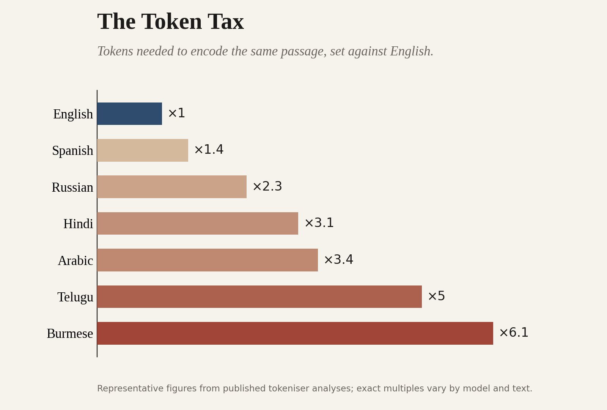
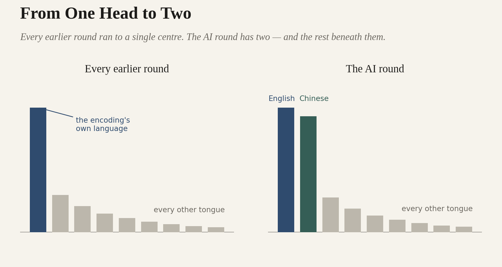

# AI Has Ancestors

## Part Two — The Post-Code Break

> *The fifth member crosses the line the first four never touched — and one language, alone in five thousand years, was ready for it.*

*A Code After essay.* 

This is Part Two of the public lead-in to **Code After Language**, the first paper in the Code After Series, due September 2026. Part One told the story of the four encoding technologies that came before artificial intelligence — writing, the alphabet, the printing press, and the digital wire — and the single pattern running through all of them: the Pre-Code condition, every technology that worked on the record of thought and left the thinking to us. Part Two turns to the fifth member, the one that crosses the line — the machine that performs thought — to the single language that was ready for it when almost none other was, and to the choice the break now forces on everyone else. The full framework, the primary manuscript, and the rest of the series are at codeafter.ai.

## The Token

The thing that performs the thinking is the large language model, and the encoding at its heart is the tokeniser. A model does not read words. Before it meets a single sentence, that sentence is broken into tokens — fragments of text, some a whole word, some a few letters, some a single mark — and it is in tokens that the machine reads, reasons, and replies. The tokeniser is the alphabet of the machine: the system that decides how language is cut into the units thought is performed on. And like every encoding before it, it was built to fit one part of the world.

The dominant tokenisers were trained on the text the internet had most of, which is English in the Latin script. English is cut cleanly and cheaply — few tokens to the sentence, room to spare. A language the tokeniser was not shaped for fractures into many more pieces for the same meaning, and pays for every one: in the cost of running the model, in the speed of its reply, in how much of the machine’s limited attention is consumed before the real work begins. The same content can cost a speaker of a long-tail language several times what it costs in English — for the hardest-hit scripts, three to six times over. We have built a new alphabet, and once again it fits some tongues and taxes the rest.

**_The Token Tax — tokens needed to encode the same passage, set against English._**

By now the shape should be familiar, because it is the shape the whole family has made. A thin resourced head — the languages the encoding fits — and a long, thin tail. Advantage flowing to whoever the technology was built around. The margin the alphabet first cut and the press industrialised, drawn a third time in tokens. It is the oldest pattern we have, running once more.

None of this is new as a comparison, and Code After does not pretend otherwise. That AI belongs in a line with writing and the printing press is by now a commonplace; that the tokeniser charges some languages many times what it charges English is measured, documented, and not in dispute. The contribution is neither the analogy nor the arithmetic. It is the reading that takes them as one mechanism — writing, the alphabet, the press, the wire, and the tokeniser, not as five resemblances but as five turns of a single thing: the redistribution of the cost of thought by whoever controls its encoding. Held as one, they stop being a scatter of suggestive parallels and become a pattern, with a history behind it, an outlier inside it, and a choice ahead of it.

But three things about this turn of the pattern are not old, and to pretend otherwise would be the real failure of nerve. The first is speed. The alphabet spread over centuries and the press redrew the map across generations; the tokeniser’s distribution set itself in a handful of years, and it tightens with every model trained. The second is that the loop now closes by itself. Each generation of models learns from the text the last generation helped produce, so the languages cheap to work in generate more of the text the next model is built from, and the gradient steepens with no hand on the lever. No king refuses this gift; no guild holds it off. And the third is the deepest, the line the press did not cross. Every earlier member of the family worked on the record of thought — storing it, reaching it, copying it — and left the thinking to us. This one performs the thinking. For the first time the cognition itself, and not merely its keeping or its carriage, is the thing being encoded, distributed, and priced by language.

This is the line Code After marks as the break between two worlds. Everything before it — writing, the alphabet, the press, the wire — worked on the record of thought, and belongs to what the framework names the Pre-Code condition. The machine that performs thought opens the Post-Code condition, the world the rest of this work is written from. That break is new, and it is why the historical frame, having consoled us this far, can console us no further.

## The Outlier

Across the whole of this history — four encodings, five thousand years — one language broke the pattern. It is worth stopping on, because it is the only evidence we have that the pattern can be broken at all.

Chinese is one of the few writing systems humanity invented from nothing, and the only one still in daily use; the cuneiform, the hieroglyphs, the lost scripts of the Americas are gone. It is, in this essay’s terms, not a twig on a borrowed branch but a root. And at every turn of the family that followed, when the cheaper encoding came for it, it refused to yield.

The alphabet swept the world, and logographic scripts fell before it almost everywhere. Korean was given an alphabet of its own. Vietnamese was carried over to Latin letters. Japanese kept its inherited characters only by growing two syllabaries around them. Chinese kept the characters — all the thousands of them — and paid the higher cost of literacy in full, because the script was doing something no alphabet could do for it.

Spoken China was a patchwork of tongues that could not understand one another; written Chinese was the single thread that held the civilisation together across them. The cost of the script was the price of the unity, and a civilisation large enough and continuous enough chose to pay it. When the press came, China — which had invented movable type centuries before Gutenberg — did not get Europe’s explosion, because thousands of characters resist movable type. But it kept its canon, its script, and itself intact: it lost the velocity of the round without losing its language to the margin.

Which brings the outlier to the newest round, and to the part that should arrest anyone who has followed the pattern this far. In the age of the machine that performs thought, Chinese is not in the long tail. It is the second head. Almost every other non-English language pays the tokeniser’s tax and slides down the gradient. Chinese is resourced at the scale of a state — its own corpora, its own frontier models, its own evaluation, its own stack. Not heritage to be preserved, but infrastructure to be built, raised in parallel to English, not downstream of it.

It is, in the vocabulary the series uses, a language made visible, workable, and necessary at the scale of a sovereign — the three conditions the framework’s Incorporation Heuristic says a language must meet to survive an encoding, satisfied in full and at once. For the first time since the alphabet, a non-alphabetic language stands not at the tail of an encoding but at its head, beside the one the encoding was built for. The distribution that runs to a single thin head almost everywhere else has, here, two.

That is the fact that breaks the fatalism. For five thousand years and four encodings, every other major tradition that met a cheaper rival was displaced, simplified, or thinned toward the edge. One refused, and survived, and has arrived at the AI round as one of its two poles. The gradient, it turns out, can be beaten. The proof is standing there.

But look closely at what beating it required, because the proof is not a template. Chinese held the line because it had what almost no other language has. It had a billion speakers and more, and a home market vast enough to make the investment pay. It had a sovereign state, continuous across millennia, willing to treat its tongue as strategic infrastructure — and the civilisational mass to carry a cost that would have broken a smaller language at the first round. The defence was available to China because China is China. The example is real, and nearly unrepeatable. China proves that the gradient is not destiny; it does not prove that the escape is cheap, or general, or open to all by the same road.

So the outlier settles one question and opens another. Whether a language can be held against the pull of a cheaper encoding — that is answered now, once and decisively: yes. How a language might be held by those who do not have a billion speakers and a continuous state behind them — that is open, and it is the question that falls to everyone else, each jurisdiction for its own tongue.

## The Choice

So the family brings us, at last, to ourselves — and to a question the earlier members never let anyone ask. In every round before this one, the redistribution happened to people. It was slow enough, and quiet enough, that no one chose it. The scribe did not decide to become a bottleneck; the unprinted dialect did not vote to become a dialect; the margin was made as a by-product, by people who could not see the pattern because they were living inside the first instance of it. We are not in that position. We are the first generation to meet one of these technologies already knowing what the family does — that it always gives, always takes, and always sorts the world into the tongues the encoding fits and the tongues it does not. Knowing that does one thing the earlier rounds never allowed. It turns an outcome into a choice.

And the choice has two halves, because the encoding is only one of them. The tongues the tokeniser fits were handed down to us; we did not pick them, any more than the Greeks picked the sounds their alphabet would favour. But what we build upon the encoding is not handed down by anyone. A technology’s existence is not its adoption, and adoption is a decision — text made in a language on purpose, models shaped to it, the work of a profession and a government kept inside it rather than allowed to drift into the cheaper tongue by default. What China leaves the rest of the world is not a method but a permission: proof that the thing can be done, and the obligation to find one’s own way of doing it.

What is at stake, if the choice goes by default, is not abstract. It is whether a language stays a place where serious work can be done, or shrinks to the speech of the kitchen and the festival while the law, the clinic, the laboratory, and the ledger move into another. It is whether the knowledge that lives only in the world’s smaller tongues — the taxonomies of ice and reef and forest and remedy that no large language ever troubled to hold — survives the crossing or quietly does not. It is whether a people can be governed in the language they actually speak. And it is, in the end, whether the human range of ways to think stays as wide as it has been, or narrows to fit the encoding, the way so much has narrowed to fit an encoding before.

That distance — between the language in which a people live, work, and are governed, and the language in which the machine that now mediates all three actually runs — is what the series calls the Linguistic Gap. It is the subject of the first Code After paper, and on the reading this essay has set out, it is the gap the family has been quietly widening for five thousand years. The AI round is only the first in which we can see it clearly enough, and early enough, to decide what to do about it.

And it is being decided inside a structure the world has not seen before. Every earlier round of the family ran to a single head — one dominant script, one set of printed languages, one centre toward which the advantage flowed. The AI round has two. English, the inheritor of the alphabet’s long advance, and Chinese, the one script that refused it, now stand as the two poles of the new distribution, each with its own models, its own corpora, its own full stack, built in parallel rather than one downstream of the other.

This is the G2: not a single empire of the encoding but two, and between and beneath them the rest of the world’s languages, none of which can any longer assume that what is built in one of the two will simply arrive, in time and without cost, in its own. The first task of every other tongue is no longer to catch the head. There are two heads now, drawing apart. It is to decide how to live among them — and whether to remain a language in which a people can think, or to let the choice be made by default, as it always has, by those who could not see that a choice was there to make.

**_From One Head to Two — every earlier round ran to a single centre; the AI round has two, and the rest beneath them._**

These are the questions Code After exists to take up. The first paper in the series, Code After Language, names the Linguistic Gap in full and sets out the response: what it calls a Sovereign Language Stack, the deliberate work by which a country keeps its language a medium of serious thought. China built one without ever needing the name, at the scale only China could. The question the paper takes up — the question now in front of everyone else — is how to build one without being China.

There is no single answer, only a fork. Let the newest alphabet sort the world as the old ones did — or decide, this once, with the whole pattern finally in view, that the margin will be held. AI is not the alien thing it first appeared. It is the latest and the fastest of the oldest tools we have, and like all of them it will give, and it will take, and it will leave the choice to us. Not what the machine can do — what we will do, and for whom.
