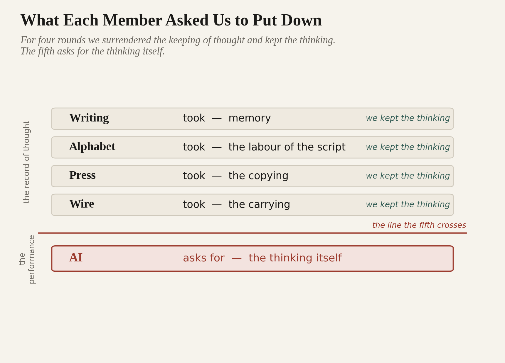

# AI Has Ancestors

## Part Three — The Substance

> *The oldest warning in the family was aimed at the wrong technology. It was waiting for this one.*

*A Code After essay.* 

This is Part Three, the close of the public lead-in to Code After Language, the first paper in the Code After Series, due September 2026. Part One set out the four ancestors and the pattern they made — the Pre-Code condition, every technology that worked on the record of thought and left the thinking to us. Part Two marked the break to the Post-Code condition, the fifth member that performs thought rather than working on its record. Part Three returns to the warning the family opened with, and to what it asks of us now. The full framework, the primary manuscript, and the rest of the series are at codeafter.ai.

## The Warning

Begin again where the family began, with the king who refused the gift.

In Part One, the Egyptian king Thamus turned down the god’s offer of writing. It would not strengthen memory, he said; it would replace it. People would take in great quantities of information and mistake it for understanding. They would have the seeming of knowledge without the substance.

He was wrong. Writing did not hollow out the mind. It became the instrument that let the mind do more than it had ever done — store more, reach further, think longer and stranger than any memory could bear. The king saw a threat and missed an enabler. Twenty-four centuries of readers, since the warning was first set down, have proved him wrong — and this essay, set down on a surface and lifted off it by you, is one more proof.

But read the charge again, slowly, with the fifth member in view. The seeming of knowledge without the substance. A device that hands you the appearance of thought and tempts you to stop doing the thing itself. He was describing writing. He was wrong about writing. He was, it turns out, twenty-four centuries early, and aimed at the wrong member of the family.

Because the first four never produced the seeming of thought. They produced the record of it, and a record cannot be mistaken for thinking, because it so plainly is not thinking. A book does not answer back. The fifth one answers back. It produces, for the first time in the family’s history, an output shaped exactly like thought, in your language, addressed to your question. Thamus feared a technology that could be confused with thinking. For four rounds the fear stayed hypothetical, because none of the four could be confused with anything of the kind. The fifth can. It is built to be.

## The Cipher and the Codebook

Here is the part worth getting precise, because the loose version of it is everywhere and it disarms the people who repeat it.

The loose version says: the machine cannot think, it only shuffles tokens, so there is nothing to fear. This is comfort, and like most comfort it puts you to sleep. Whether the machine thinks is not the question the family asks, and it is not the question that decides anything. Part One stood on the ground that does not give way — cost and access, the observable part — and declined the thrilling claims about minds. This essay keeps that footing. We do not need to settle what is happening inside the box. We need to be precise about what happens at the two ends of the exchange.

At the machine’s end, an output is produced. Call it the cipher: a sequence shaped like meaning, generated by a process that runs on probability rather than on having lived. At the human’s end, the cipher is read, and something turns it into meaning. That something is you — your memory, your experience, the knowledge you carry, the world you have moved through. The machine writes the cipher. You hold the codebook. The meaning is not shipped from the machine to you; it is supplied by you, on receipt, out of what you already are.

This has always been true of reading. A book is a cipher too, and the reader supplies the world that makes it mean. But a book also built the codebook it required. To read one you had to become a reader; to follow an argument you had to have followed others; the difficulty of the marks was the exercise that made the mind able to meet them. Cipher and codebook grew together. That is the loop the fifth member breaks. It asks for no codebook. It meets you where you are, in your own words, and hands back something finished — so the cipher now arrives without building the reader who could judge it.

What has changed, then, is what the cipher asks of the codebook. A book gives you marks and leaves the understanding to you. The fifth member performs the understanding for you — fluent, finished, plausible — and asks you to do nothing. And that is the exact location of Thamus’s fear. Not that the tool cannot think. That the person, handed the appearance of thought, will stop.

Watch it happen. The machine returns a paragraph that is confident, well-formed, and wrong — a case that was never decided, a source that was never written, a figure off by an order of magnitude. Nothing in the cipher marks the error. It is set down in the same even voice as the truth. What catches it, when anything does, is the codebook: a reader who has done the work, holds the field in their head, and feels the wrongness before they can name it. Take that reader out of the loop and the error sails through, fluent to the end. The cipher cannot check itself. Only the codebook can.

## The Default

Each member of the family asked us to put down a faculty and trust the tool with it. Writing took memory out of the body. The alphabet took the labor out of learning the script. The press took the copying. The wire took the carrying. Every one was an outsourcing, and every one was, on balance, a gain — because in each case we surrendered the keeping of thought and held on to the thinking of it. We let the marks remember so that we were freed to understand. The substance stayed with us.

The fifth member asks for the substance.

*What Each Member Asked Us to Put Down — for four rounds we surrendered the keeping of thought and kept the thinking; the fifth asks for the thinking itself.*

It offers to do the understanding — the drafting, the deciding, the working-through — and to hand it back finished. And the offer is good. That is the trouble. A bad tool is refused; a good one is adopted by default, with no one choosing, the way the scribe never chose to become a bottleneck and the unprinted dialect never voted to become a dialect. The redistribution in the earlier rounds happened to people while they were looking the other way. This round happens at the speed the machine runs, which is faster than anyone looks.

What thins, if it goes by default, is not a skill. It is the codebook. The capacity to take a fluent output and weigh it, doubt it, find the place where it is confidently wrong, and overturn it — that capacity is built by doing the work, and it decays when the work is handed off. A reader who has stopped reading cannot tell a good cipher from a bad one. A profession that has stopped doing its own reasoning cannot supervise the machine now reasoning in its place.

You can see the first signs already. The junior who never drafts the memo, only edits the machine’s, and a year on cannot draft one alone. The analyst who passes the model’s answer up the chain without the judgment to know when it is wrong. The student who submits the cipher and skips the struggle the work was set to produce. None of them decided to stop thinking. Each made a small, reasonable trade — faster, easier, good enough — and the codebook thinned by a page a day. The danger was never a machine that thinks. It is a population that has quietly agreed to stop.

And the loss is silent, which is what makes it dangerous. A failing bridge shows cracks. A thinning codebook shows nothing — the outputs look the same, fluent as ever, right up to the moment no one in the room can tell the sound answer from the merely plausible one. The press left its losers visible, at the edge of the page. This round hollows the center and leaves the surface intact.

This is the fork the series has named throughout: deliberate construction against default acceptance. Urgent questions left unasked become structural answers by default. Whether the codebook is kept is one of those questions, and it is being answered right now, mostly by no one, mostly by drift.

## The Substance

There is an individual version of this and a civilizational one. They are the same problem at two scales — in both, the tool is good, the trade is reasonable, and the loss stays invisible until it is structural — and the second is what the rest of Code After is about.

For a person, keeping the codebook is a discipline, not a refusal. Use the cipher, and keep reading. Let the machine draft, and keep deciding. Take the fluent answer, and keep the habit of finding where it breaks. Do some of the work yourself even when the machine would do it faster — not out of nostalgia, but because the capacity to judge the output is built only by producing it, and an unused capacity does not idle. It goes. The machine can perform thought. Whether you keep doing it is left, as it always was, to you.

For a people, the codebook is the language itself. A tongue kept as a medium of real work — law, medicine, science, the record, the ledger — is a civilization keeping its codebook in working order. A tongue allowed to drift into the kitchen and the festival while the serious thinking moves into the cheaper one is a civilization handing its codebook to someone else’s machine and forgetting it ever held one.

It happens one office at a time. A ministry reaches for the best tool, and the best tool runs in English, so its reports are drafted in English first and rendered into the home tongue after, if at all. A hospital’s notes follow, then a court’s filings, then a university’s science. Nothing is banned. The smaller tongue simply stops being the place where the hard thinking is done, and a generation on the words for the new work do not exist in it, because no one was ever made to think them. The language is still spoken. It is no longer thought in.

That distance — between the language a people live in and the language the machine runs in — is the Linguistic Gap, and on the family’s reading it is the codebook problem written at the scale of a nation.

This is why the first paper in the series is about language and nothing else. The Sovereign Language Stack it sets out is the deliberate work of keeping a language a place where thought is still performed by the people who speak it — the codebook held, this time at the scale of a nation. China has one already, built at a scale only China commands. What Code After Language takes up is the harder problem it leaves to everyone else: how to keep the codebook without a billion speakers and a continuous state to keep it with — how to build one without being China.

So the family closes where it opened, with a king and a gift. Thamus refused his, and he was wrong; the gift was good, and the people who took it learned to keep the substance while the tool kept the record. We are offered a different gift, by a different god, and the terms have changed. This one offers to keep the substance too. No king will refuse it. It is far too useful, and it does not wait for permission. The only question it leaves is the one Thamus was really asking, twenty-four centuries too early. Not whether the machine can think. Whether we will.