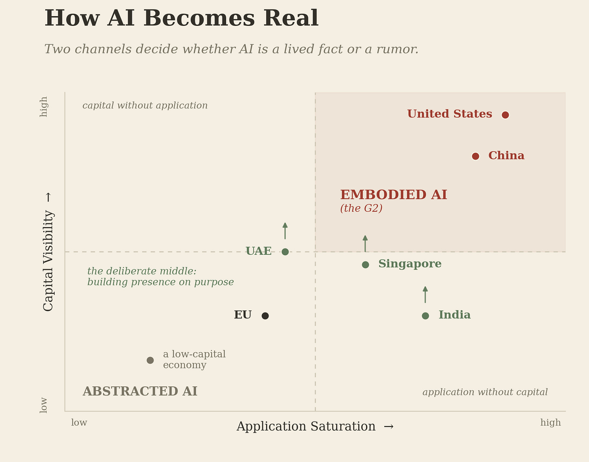
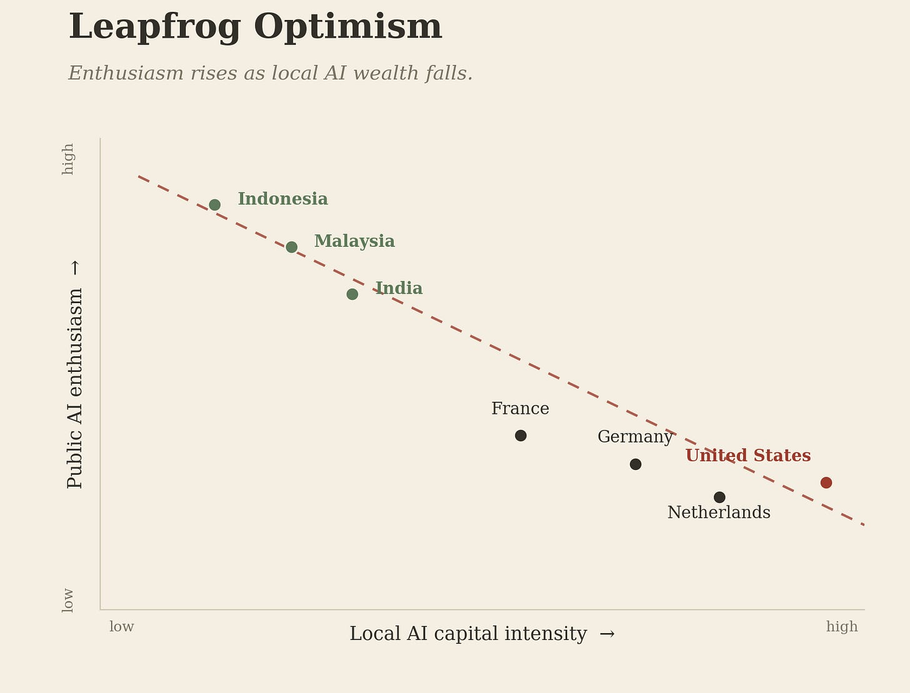
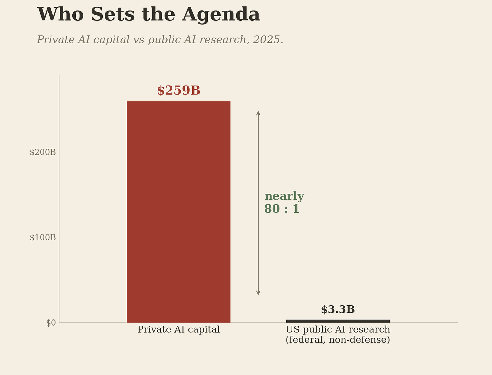

# The Uneven Present
>_A Code After essay · companion to Code After Language_

AI is not one global conversation. It runs at different temperatures in different places, and the distance between hottest and coldest is wider than any single debate can hold.

At one end, AI is wealth, work, and anxiety at once — met in paychecks, portfolios, and the quiet arithmetic of whether a job survives the decade. At the other, it is regulatory text and foreign headlines, a technology built somewhere else. In the first, AI is a fact one lives inside. In the second, a rumor one reads about.

Call the difference the Awareness Asymmetry. It is not a knowledge gap or a skills gap; the publics farther from the frontier are sometimes better read on AI risk than those closest to it. The asymmetry is about presence: whether AI is a present-tense fact in a society’s life, or a future tense arriving from elsewhere. This essay names the mechanism. The companion Language paper named the response.

## Two Channels, and a Third

A population does not decide AI is real. It is made real. Two forces do it on their own; a third has to be built.

The first is Capital Visibility. AI arrives as wealth before it arrives as a tool — an IPO headline, a valuation that resets the local meaning of a large number, a paycheck that exists because the money came to town. The citizen sees AI in the financial periphery long before meeting it in the workflow.

The second is Application Saturation. AI arrives as something one touches: payments, search, messaging, the clinic, the classroom, the day’s work. Not a concept to read about, a surface to use, often before it is named.

Capital without application is market chatter, significance with nothing to touch. Application without capital is convenience with nothing at stake. Only where both run at scale does AI cross into the present tense. Call that Embodied AI; call its absence Abstracted AI.

This is the perceptual face of the Visibility Gap. The G2, the United States and China, runs both channels at scale. Most of the world runs one weakly, or neither. But two channels are not the whole map, the rest of this essay builds toward the third.

## The Two Poles

Start where both channels run hot. In 2025 the United States absorbed roughly three-quarters of global AI venture capital, on the order of $190 billion of some $260 billion worldwide. China’s private share looks small only because its build runs through a state-hybrid channel venture totals miss: capital expenditure on the order of $100 billion, its largest platforms committing tens of billions more. Here AI is not a line item; it is the line that moves the others. The application channel runs as hot — payments, manufacturing, and clinics in China, work and study in the United States, at a saturation no policy mandated. The citizen does not learn that AI exists; the citizen uses it before lunch. Enthusiasm and dread in equal measure, never indifference. At this pole, the one thing AI is never allowed to be is boring.

Across most of the world, one channel is weak and the other missing. Where capital is scarce, the media is thin — no domestic unicorn, no listing-day headline, no neighbor whose portfolio just moved — so AI stays foreign business news, reported like another country’s weather. Where application is thin, AI arrives as an import: real tools encountered as borrowed goods, often in a second language tuned to someone else’s market. Utility without ownership does not make AI feel like one’s own.

The European Union is the instructive case: rich, capable, still abstracted. It draws only a small share of global AI venture capital, and for many Europeans the most visible sign of AI is not a domestic champion but a new rule, a hearing, a compliance fight. AI enters public life as something governed rather than built. The result is a paradox: a European can feel farther from AI creation than someone in a less-regulated emerging economy, not for want of capacity but because regulation is more visible than production. The EU is G3, not periphery. Still, for much of its public, AI is built elsewhere and governed here. This is the Translation Layer at the level of perception: regulation bridges the gap between system and state, and masks it — reassuring a public that AI is handled while keeping AI itself at one remove. The bridge that reassures is the bridge that distances.

## The Deliberate Middle

Between the poles, a third position is forming — the most instructive development since this framework was first drafted. A few jurisdictions have stopped waiting for capital and application to arrive on their own, and are building presence on purpose.

Singapore funds locally tuned models for Southeast Asian languages and drives adoption through public services. The UAE backs Arabic-first models and sovereign compute, building the channel it cannot import. India hosted the first global AI summit in the Global South — the AI Impact Summit, New Delhi, February 2026 — on two arguments this series shares: that capability should not concentrate in a few hands, and that under-represented languages belong inside the models. It pairs them with an application base most of the abstracted world lacks: payments and public services already at national scale.

None reproduces the embodied pole’s loop; the capital is not there to match. What they share is intent — each constructing the sense that AI is its own, through language, sovereign compute, or hosting the conversation rather than receiving it. Early, uneven, not yet self-sustaining, they are the first proof the asymmetry can be worked against on purpose. The map is not two buckets but a gradient: a crowded top corner, a long tail, and a thin, widening band climbing it by design.

## Leapfrog Optimism

Here the pattern inverts. The publics with the least AI capital are often the most optimistic about it. Surveys across dozens of countries — KPMG with the University of Melbourne, Anthropic, Stanford’s AI Index — converge on one shape: enthusiasm rises as local AI wealth falls. Indonesians and Malaysians report far more enthusiasm for AI in daily life than Americans, Germans, or the French. The societies building AI are warier of it than the societies receiving it.

The reflexive reading is that optimism tracks ignorance. It does not. One explanation is demographic: younger, mobile-first populations adopt without the institutional memory that makes wealthier publics cautious. The other is the one this series pursues — where AI speaks a population’s own language, where a locally tuned model answers in the register people think in, AI can feel near without a dollar of local capital behind it. Call it Leapfrog Optimism: the third channel, read from the demand side rather than the policy side. The first evidence it exists.

 

## Why It Widens

None of this holds still. Capital concentrates, and concentration governs what follows. It draws coverage; coverage draws political attention; attention hardens into institutions — committees, funding lines, national strategies — and those make the next round of capital easier than the last. The embodied pole is already inside the flywheel. Most of the world never reaches it: without a first concentration of money, the cycle never begins, and what never begins cannot compound. This is why the deliberate middle is so costly — Singapore, the UAE, and India spend state capital to manufacture a first turn the embodied pole now gets for free.

It is also why the word is asymmetry, not gap. A gap is a distance: fixed, measurable, closable by walking toward it. An asymmetry is a process; it widens while you measure it. A gap invites you to catch up. An asymmetry has already moved by the time you try.

One number turns perception into structure. In 2025, global private capital put roughly $259 billion into AI; the entire US federal non-defense AI research budget ran near $3.3 billion. Nearly eighty to one. At that ratio, the direction of AI research is set not by public deliberation but by investor conviction — and conviction tracks the wealth at the embodied pole, which tracks that pole’s problems. So AI reaches a jurisdiction outside the pole already shaped — its questions, languages, and priorities fixed by a few markets’ venture economics. A clinic in Lagos, a ministry in Jakarta: each inherits an AI that was finished when it arrived. Call it the Diffusion Substrate. Most of the world is not choosing how to use AI, only what to do with it.
 
## Governance, and the Channel Still Open

Here the asymmetry stops being about feeling and starts being about power. Governance needs a public that wants it. Where AI is present tense, citizens press for adoption and for limits in the same breath. Where it is abstract, there is no felt stake, and governance proposals accrue Legitimacy Debt: rules written ahead of any public that asked for them. The deeper problem is one of clocks. AI’s output legitimacy — the sense a system is fine because it produces results — runs at machine speed. Input legitimacy, earned by a public deliberating and consenting, cannot be accelerated by procedure; where AI is abstract, it has nothing to accelerate from. The window to shape AI’s governance opens for everyone on paper. It opens unevenly in practice.

Which returns us to the third channel. Capital can be concentrated and application imported, but a society cannot wait for either to feel AI is its own. The Language paper set out the alternative: linguistic inclusion, distinct from capital and application, through which a country builds proximity it cannot buy. Its institutional form is the Sovereign Language Stack — a Visibility layer, a Workability layer, and a Necessity layer, built together — and its closest working approximation is Hong Kong, built to hold two legal and linguistic systems in parallel long before AI made the capacity decisive. The deliberate middle has already shown the channel is real, and that it can be opened on purpose.

So the Awareness Asymmetry is not a deficiency in the publics that live with it. It is a structural condition produced by where capital and application have landed. Closing it means one of two things: reproducing the embodied pole’s loop at home, or building the third channel on purpose. The first is foreclosed for nearly everyone — not for want of ambition, but because the frontier now sits behind a data wall only two civilizations have cleared, and a civilization’s worth of digitized language is the one input that cannot be bought, only built across decades. The third channel is the part still open.

That is the choice between deliberate construction and default acceptance. A few have started to make it. AI does not wait for a society to feel it. Whether most of the world meets AI as its own fact or as someone else’s is being settled now, in the interval before the feeling arrives.

---

_Figures: global AI venture capital and the U.S. share from the OECD’s_ Venture Capital Investments in Artificial Intelligence through 2025 _(2026); U.S. federal non‑defense AI R&D from the CSIS FY25 analysis; cross‑country survey direction from the KPMG–University of Melbourne_ Trust, Attitudes and Use of Artificial Intelligence: A Global Study 2025 _; and comparative public‑attitude trends from the Stanford HAI_ AI Index Report 2026_._