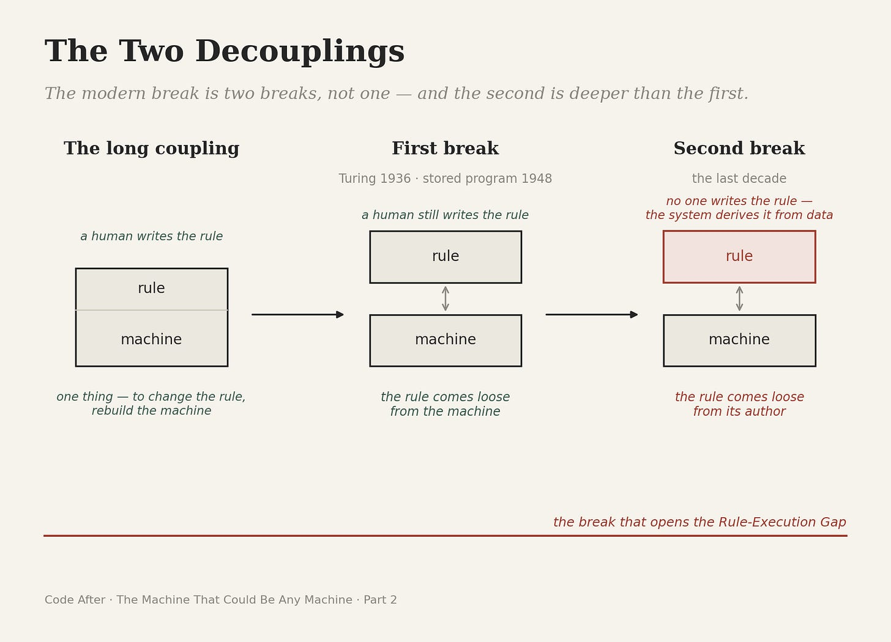
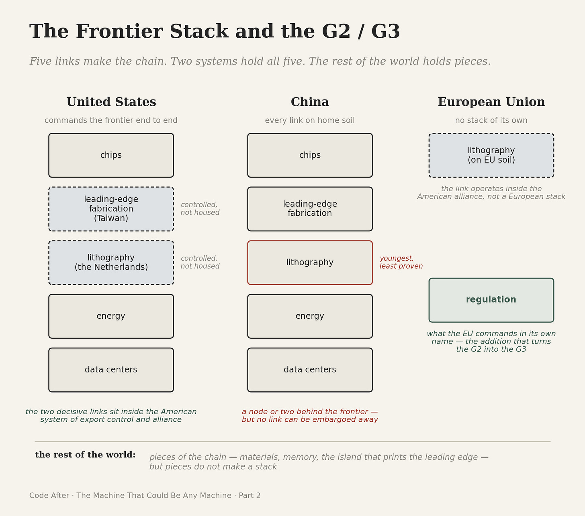

# The Machine That Could Be Any Machine
>  Part 2 of 2 — The Decoupling

_Part 2 of 2. In Part 1, the rule and the machine were one thing for thousands of years, and that binding kept computation governable without anyone trying. Here it comes apart — first from the substrate, then from its author — and the power concentrates in two hands._

In 1936 a mathematician of twenty-three set out to answer a question about the limits of logic and ended up describing the machine on the desk. The question was whether there could be a single procedure that decided, for any mathematical statement, whether it followed from the axioms. To answer it, Alan Turing had to define what a procedure was, and to do that he imagined the simplest possible machine: a strip of tape, a head that could read and write one symbol at a time, and a table of rules telling it what to do next.

Then he proved the move that takes the binding apart. One such machine, given a description of any other machine written onto its tape, could behave as that machine. A single device could become all devices by reading a different description. He was not trying to build a computer. He was settling a problem in the foundations of mathematics, and the universal machine fell out of the proof as a consequence its author barely paused on.

This was the move no one in the long history had made. Leibniz had dreamed past his brass. Babbage had drawn an engine the workshop and its backers could not bring into being. Lovelace had seen generality before there was a machine to show it. Each time the idea ran ahead of the hardware. Turing’s idea ran ahead too: the universal machine was a proof on paper in 1936, and the physical form that could carry it did not yet exist. The difference, this time, was that it was about to.

The war forced the pace. At Bletchley Park, Turing designed the Bombe, an electromechanical machine that broke the German Enigma cipher by testing settings faster than any room of people could, building on earlier work by Polish cryptanalysts who had first mechanized the attack. A separate effort produced Colossus, the first large scale electronic digital machine, built by the engineer Tommy Flowers against a different German cipher. These were the most powerful machines yet made, and they were still bound. Each did one task. To break a different code you rebuilt the apparatus. The universal machine Turing had proven in 1936 was still waiting, even in the building where he worked, for a body general enough to be it.

The body arrived after the war, in an idea so plain it is hard to see how radical it was: keep the instructions in the same memory as the data. A 1945 report drafted by John von Neumann, working with the Moore School team that had just built the wartime ENIAC, set out the design for its successor: a machine whose program was not wired into its structure but stored as numbers it could read, change, and overwrite — numbers written, as it turned out, in the two symbols Leibniz had imagined nearly three centuries before.

In June 1948 a machine in Manchester ran the first program held in its own memory. The American ENIAC had been rewired to run from stored instructions a few weeks earlier; the Manchester machine was the first built from the start to do it. From that point you no longer rebuilt the machine to change the task. You changed what was written in the store. The binding that had held since the abacus, in which you rebuilt the device to compute something new, was now broken in practice. The procedure had gone soft.

What happened next was speed. The vacuum tube gave way to the transistor in 1947, the transistor to the integrated circuit, and the circuit to a curve that doubled the components on a chip every couple of years for half a century. The Pre-Code world had stayed governable in part because computation was slow, local, and scaled to the hand, slow enough that the clerk and the ledger kept pace without effort. That slowness was now gone. The decoupled rule, soft and rewritable, began to propagate at the speed of silicon, and nothing in the institutions built around the old pace was designed for it.

By the 1980s the universal machine, once a rare instrument tended by specialists, sat on desks in homes and offices. The locality that had also held computation in check was gone with the slowness. Anyone could run any rule, and most people now did.

Then the rule lost its author. For everything described so far, a human still wrote the procedure. Pascal filed it into gears, Jacquard punched it into cards, the programmer typed it into the store, but a person somewhere set down the steps. The machines of the last decade broke that too. Given enough parallel computation, supplied by graphics chips built to draw images and turned to a use no one designed them for, a system could derive its own rule from data rather than receive it from a person.

The model is a procedure no one wrote line by line. There is no author to question, no text to read, no clause to audit. The humans have not left the room — they choose the data, set the objective, decide what ships. But choosing the conditions under which a rule forms is not the same as writing it, and the difference is the whole point.

In 1936 the rule came loose from the material base. Now it comes loose from the human who used to write it. This is the deepest break in the whole history, and it is the one that opens what this project calls the Rule-Execution Gap: the rule that governs and the rule that runs are no longer the same kind of thing, and no longer written by the same kind of hand.

Put these together and you arrive back at the machine on the desk from the start of this essay. It is the universal machine Turing proved, built from chips descended from the transistor, running rules it derived rather than received. Smaller than a book, it can become almost anything because it is the thing that can become anything, now carrying procedures no human composed. The strangeness we had stopped noticing has a precise description. It is the Pre-Code binding, fully undone.

This is the Post-Code condition. In the Pre-Code world, computation could not outrun the people and institutions that governed it, and so it stayed governable without anyone trying. The Post-Code world revokes that quiet gift. A rule that is separable from its machine, rewritable in memory, moving at the speed of silicon, and no longer written by a human hand cannot be kept pace with by institutions built for the abacus and the ledger. The law drafts one rule; the system runs another; the distance between them is the gap the whole project begins from.

There is a second consequence, and it is the one this essay was built to reach. The abacus belonged to everyone. So, in the end, did the PC. The frontier stack belongs to almost no one. Running computation at the frontier takes a chain few states command: the chips, the fabrication plants that print them, the lithography machines those plants depend on, the energy to run it all, and the data centers to house it.

Two systems hold a complete version of that chain, and Code After has named them the G2 from the start. The United States commands the frontier end to end, not by housing every link at home but by controlling the two that decide it: the leading-edge fabrication concentrated in Taiwan and the lithography that can be built only in the Netherlands both sit inside the American system of export control and alliance.

China holds the only other complete chain, every link of it on home soil — the lithography link the youngest and least proven, its most advanced fabrication still leaning on Dutch machines bought before the door closed. Exclusion from the two decisive links holds the whole stack a node or two behind the frontier. But behind is not absent. A stack that answers to no foreign control can be slowed; it cannot be switched off.

A third power, the European Union, holds one decisive link on its own soil — the Dutch lithography works — but that link operates inside the American alliance, not a European stack. What the EU commands in its own name is regulation, and it is that addition which turns the G2 into the G3.

The Decoupling, which loosened the rule from its machine and then from its author, does not arrive evenly. It arrives as a divide: two full stacks on one side, and the rest of the world holding pieces of the chain or none of it. The pieces are not small — Japanese materials, Korean memory, the island that prints the leading edge — but pieces do not make a stack. The most physical form of the divergence this project tracks is not language, and not law. It is the machine itself.

When the two stacks pull apart, what, if anything, can sit between them and keep the world legible to itself? A later essay in this series takes that question up as jurisdiction and territory, and the series has a candidate. This one had only to establish why the question is forced, and the answer is on the desk.

Turing proved that anyone could run any rule. The frontier proved that running it at the highest level is a privilege held within two systems. The distance between the universality he demonstrated and the concentration the substrate imposes is where the politics of artificial intelligence begins, and it is not a politics the abacus or the loom ever had to have.

One thing remains, and it is what binds this essay to its companion. The material base that now runs the world’s rules was built in, and runs best in, a handful of languages. The software of civilization and the hardware of civilization have come loose from their old moorings in the same era, and they have concentrated in the same few hands. Language is the rule. The machine is the substrate.

For most of history both were bound to the people who carried them. They are bound there no longer, and the small number of places that hold both will shape what the rest of the world is able to think and to build. That is the condition we are now governing inside, whether or not we have named it. This series is an attempt to name it.