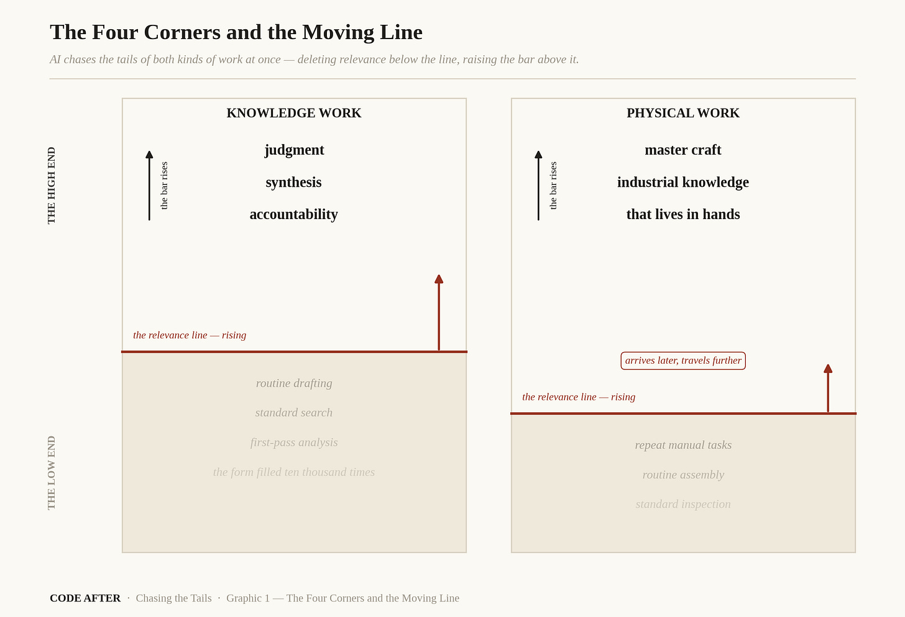
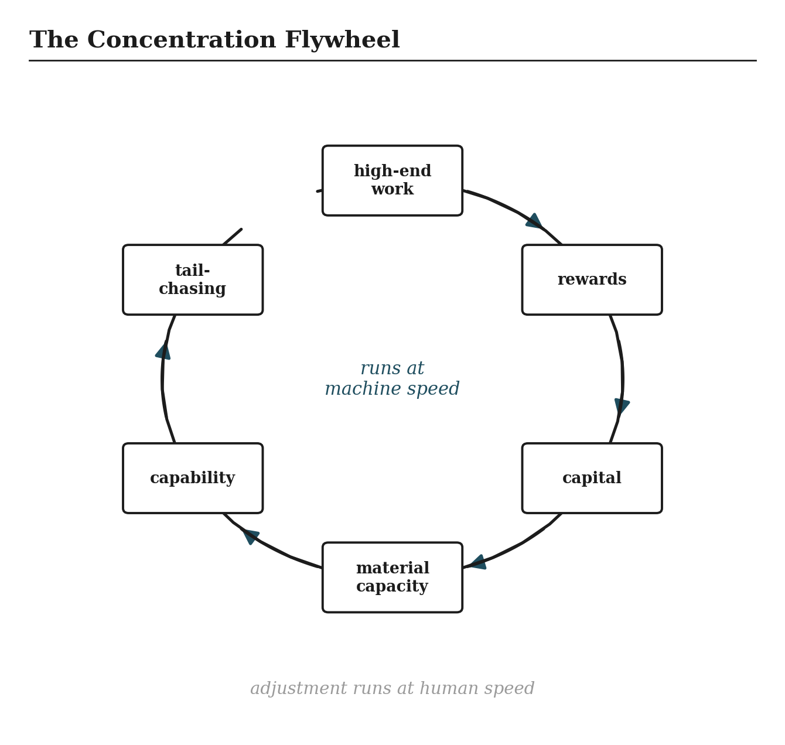
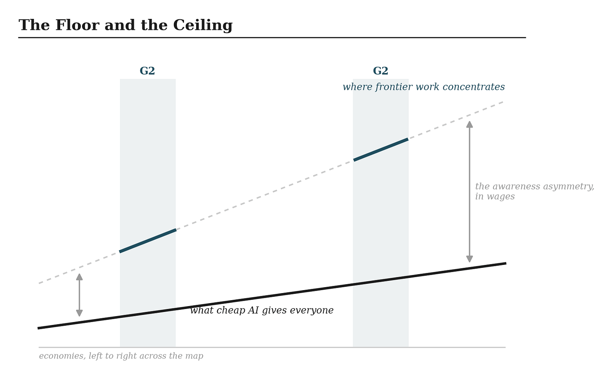

# Chasing the Tails
_AI is reshaping work twice — once inside every workplace, and once across the map. The first everyone argues about. The second almost no one is governing._

The standard frame says AI takes jobs. The frame is wrong in a way that matters, because it points every argument at the wrong number. Headcount is not where the change is happening. Relevance is.

Watch what the systems actually do. At the low end of work, they do not fire anyone. They make the task beneath them stop being worth a person: the routine draft, the standard search, the first-pass analysis, the form filled the same way ten thousand times. The work does not disappear from the org chart on day one. It disappears from the list of things a human needs to be good at. And at the high end, the same systems do the opposite. They raise the bar and raise the value. Judgment over output that arrives in seconds. Synthesis across more material than any person could hold. Accountability for decisions a machine can draft but cannot own. The person who can do those things is worth more than before, and there are fewer tasks left in between to climb on the way there.

AI does not automate work evenly. It chases the tails — deleting relevance at the low end and raising the stakes at the high end — and it does this to both kinds of work at once. Knowledge work first, through the systems already on every desk. Physical work next, through machines that are learning to handle the world the way the desk systems learned to handle text.

Economists will recognize a relative in this argument. The polarization literature — David Autor’s name is on most of it — spent two decades documenting how earlier automation hollowed out the middle of the labor market while the ends held. Tail-chasing is a different animal. Polarization described a one-time collapse of the middle. Tail-chasing describes a frontier that moves: the low end is not a fixed set of jobs but a rising waterline, and the high end is not a safe harbor but a shrinking summit that keeps gaining altitude. Code After uses the new term because the old one describes a finished event, and this one has not finished anything.

Take the two columns in turn.

In knowledge work, the deletion is already ordinary. Drafting, summarizing, first-pass research, standard analysis: a competent system now does these at a marginal cost near zero, in any volume, at any hour. What gains value is everything the system cannot own. Knowing which question to ask. Knowing which answer is wrong. Holding the codebook — the accumulated judgment about what a clause means in practice, which precedent actually governs, what the client will and will not accept — that no transcript of outputs contains. The professionals who hold the codebook are not being replaced. They are being promoted into a smaller room, and the ladder that used to lead to that room, built from exactly the routine tasks now deleted, is being pulled up behind them.

In physical work, the same logic arrives later and lands differently. Embodied AI lags abstracted AI for a plain reason: the world pushes back, and text does not. But the direction is identical. Routine manual tasks erode first; the premium flows to master craft and to the industrial knowledge that lives in hands and cannot be written down. And physical work carries one advantage knowledge work does not.

The language systems reshaping offices think in a handful of tongues and carry the assumptions of the cultures that trained them. A weld is a weld in every language. The physical layer is less culturally loaded than the linguistic one, which means the reshaping of physical work, when it arrives in force, will travel further and translate more cleanly than anything happening in the office tower.

Now mark the property that makes all of this a condition rather than an event. The frontier between the tails moves. Today’s high end is tomorrow’s automatable routine; the judgment task that commands a premium this year gets absorbed into the next model generation’s baseline. This is continuous reclassification, and it breaks the standard remedy. A worker can retrain once. A firm can restructure once. Neither can do it every eighteen months indefinitely, and the systems do not pause between rounds.

What sets the pace of the rounds is the cost of capability, and the cost of capability is collapsing. The clearest exhibit is the model release that reset open-weight economics this April. DeepSeek’s V4 runs a million-token context at roughly a quarter of the computation and a tenth of the memory its own previous generation required, ships its weights to anyone who wants them, and prices its smaller variant at cents per million tokens. Read precisely, the efficiency story has two halves, and the difference between them is the hinge of this essay. Inference — running the model, pointing it at tasks — is now cheap and getting cheaper, and DeepSeek has committed its own serving to domestic Chinese chips, with American chipmakers pointedly denied early access.

Training — building the frontier model in the first place — still leans on the American hardware ecosystem, and by the most careful readings V4’s deepest training runs likely did too. Inference sovereignty is arriving; training sovereignty remains one or two hardware generations out. Which means the floor of what AI cheaply deletes is rising fast everywhere, because cheap inference travels. The ceiling — the frontier work of building what comes next — still gates on the full stack, and the full stack, as the hardware essays laid out, belongs to two systems.

That sentence is the seam of this essay. Everything above it happens inside a society. Everything below it happens between them.

**Where the work goes**

High-end work has a property low-end work never had: it can be performed wherever the stack and the talent sit. The deleted tasks were everywhere; the elevated ones are portable, and portable work concentrates. The early signals all point the same direction. Venture capital has reorganized around the technology — by the OECD’s count, AI firms took 61 percent of all global venture investment last year, and three-quarters of that landed in the United States — while China’s buildout runs through state capital and corporate balance sheets the venture ledger never sees.

Two systems, financed by different instruments, arriving at the same concentration. The data-center buildout is concentrated in the same two systems. The frontier labs hire into a handful of cities on two coasts and a few Chinese hubs. None of this is yet a settled migration, and this essay states it as a direction rather than a destination. But the direction is not ambiguous: the high tail of work is drifting toward the G2, because that is where the machines that define the high tail are built.

And the drift compounds. More high-end work means more rewards; more rewards mean more capital; more capital buys more material capacity — chips, plants, power, data centers; more capacity produces more capability; more capability chases more tails; and the tails it catches send their value back to the start of the loop. This is the concentration flywheel, and it is the engine of the whole argument. Nothing in it requires malice or strategy. It only requires the loop to run faster than anything outside it, and it does.

Concentration of work across borders is a trade story, and here the governance shelf is nearly bare. Trade policy has centuries of instruments for goods: tariffs, quotas, rules of origin, dispute panels. It has almost nothing for the migration of high-value work toward the full-stack cores. A tariff can hold a manufactured object at the border. No instrument holds a task, and the tasks are what is moving now. The trade wars on the front page are fought over the old flows while the new one runs ungoverned beneath them. This is the under-governed front, and the formal papers in this series take it up where this essay leaves it.

Beneath the trade problem sits the deeper one, and it is the sober core of this essay. The flywheel runs at machine speed. Everything that absorbs its output runs at human speed: a worker reskills in years, a firm restructures in years, an institution adapts in decades. The central governance challenge of the next decade is not automation. Automation is old. The challenge is the widening gap between the speed at which work is reclassified and the speed at which people, firms, and states can answer — and a gap that widens on its own schedule does not wait for the institutions to convene.

Hold both truths, because the story is two-sided and the doom version misses half of it. The floor is rising everywhere. Open-weight models at collapsing prices mean a clinic in Nairobi, a workshop in Hanoi, and a classroom in Recife now reach capability that belonged to a few corporations three years ago. Access is widening at the same moment the high-value work is narrowing. Both are true, and the pair defines the actual choice in front of every economy outside the G2.

The choice is not whether to participate — the rising floor settles that. The choice is whether to claim a slice of the value layer deliberately, while the reordering is young and positions are still open, or to drift on the rising floor and inherit whatever the flywheel leaves behind. Deliberate construction or default acceptance. The fork is the same one this project has named before, and the works question is where it cuts closest to home, because everyone stands somewhere in the two-by-two.

This essay has carried five claims to the edge of formality and left them there on purpose. The language a model thinks in, and what it costs a society to think through someone else’s — the Sovereign Language Stack papers take that up. The gaps between what institutions can see, execute, categorize, and measure — the gap papers. The layer that masks divergence while it widens — the Translation Layer paper, the center of the series. The arithmetic of what makes participation real rather than nominal — the Incorporation Heuristic. And the question of where, on a map splitting into two stacks, the seam can still be worked — that paper has a candidate, and it is a harbor.

The work is moving twice: off the middle of every job, and across the map toward the machines. The first movement everyone feels. The second almost no one is governing. Naming both before they finish is the point of going first — urgent questions ignored become structural answers by default.
