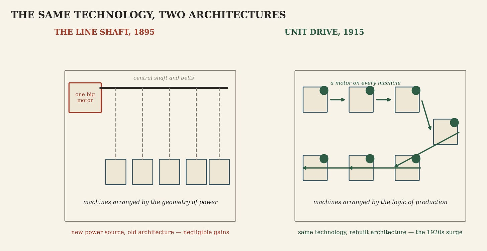
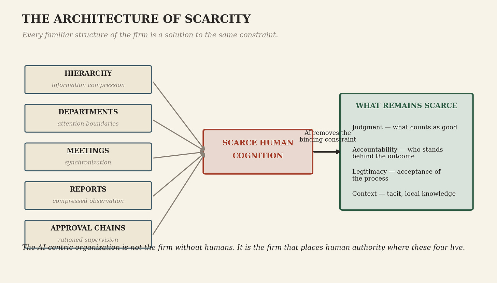
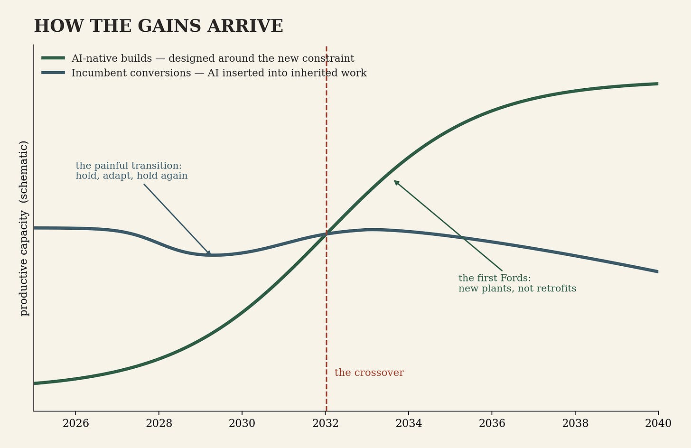

>_An essay in the AI Has Ancestors series._

AI is not the next internet. It is the next electricity — a general-purpose production technology whose gains arrive only when organizations stop being designed around the scarcity it has begun to remove.

This series has argued that AI has ancestors: writing, the alphabet, the printing press, the digital wire — the family of encoding technologies, of which AI is the fifth member and the first to perform thought rather than work on its record. That is the lineage of kind. It tells you what AI is.

There is a second lineage, and it tells you how AI pays. It is the lineage of general-purpose production technologies — the short list of inventions that changed not one industry but the economics of many. On that line, the ancestor everyone names is the wrong one.

The standard comparison makes AI the successor to the internet: the next platform shift, the next adoption curve, the next layer in the stack. The comparison captures something real and misses the essential thing. The internet transformed how information moves — transmission, coordination, distribution — and whole industries reorganized around that fact. AI acts one level deeper. It operates on the production of cognitive work itself: it drafts, classifies, analyzes, codes, designs, plans, and increasingly coordinates work across those functions. The internet changed how the economy communicates. AI changes how much cognitive output the economy can produce and where human attention must enter the process.

Executives running the internet playbook — build a channel, add a layer, capture distribution — are optimizing transmission while the event is generation. They are getting from AI exactly what that playbook is built to extract: local gains from a systemic technology.

The internet was not AI’s predecessor. It was AI’s precondition.

## The grid before the machine

Three decades of digitization rendered large parts of economic life legible to machines. Filings moved online, transactions became database entries, workflows migrated into software, archives became searchable — none of it undertaken for AI, all of it now the substrate AI trains on and operates in. The internet era, seen from here, was the grid-laying phase: it did not produce the new production technology; it made the economy readable to one.

The precondition is unevenly distributed. China built digital integration across payments, logistics, commerce, and public services at population scale, and in July 2026 received the clearest signal its system can issue — the leader’s personal endorsement — that AI is the national priority. That story runs in its own essays; here it is one sentence: the country said to have won the internet era is better described as having laid its grid first.

Digitization was necessary. It determined nothing about the organizational form that follows — and the organizational form is where every general-purpose technology has won or lost its decades.

## The dynamo’s long delay

Consider the factory of 1890. A central steam engine, the largest capital asset in the building, turned line shafts running the length of every floor, leather belts dropping power to each machine. The entire architecture followed the geometry of power transmission: multi-story construction so shafts could distribute power vertically, machines crowded where belts could reach, materials moving according to the location of power rather than the sequence of production. The factory was not designed around what it made. It was designed around how power reached the machines.

Electricity dissolved that constraint. Power could travel by wire and be allocated at the point of use — eventually down to a drive on every machine. And for two decades, almost nothing happened. Factory owners made the obvious move: they replaced the steam engine with one large electric motor and left the shafts, belts, buildings, and layouts alone. New power source, old architecture. Around 1900, electric motors drove less than five percent of American factory machinery, and the measurable gains were thin enough that a reasonable observer could call the technology overhyped.

The delay was not a failure of the technology. It was the time it took to imagine — and then to finance, build, and staff — a different factory. The decisive idea was organizational, not electrical: unit drive, a motor on every machine. Unit drive removed the constraint the whole factory had been built around. Machines could be arranged by the logic of production instead of the geometry of the shaft. Factories went single-story. Materials flowed in sequence. Overhead cleared for cranes and conveyors. By 1920, electricity’s share of factory drive had passed half, and in the 1920s American manufacturing productivity surged — roughly four decades after the dynamo, and only after the redesign.

The emblem of the new architecture was Highland Park. Ford Motor Company was founded in 1903, a young firm in a young industry; the Highland Park plant opened in 1910 as a purpose-built structure with no inherited layout to defend; the moving assembly line began running there in 1913. The line was not one immaculate insight — Ford’s engineers experimented and combined — but its most famous borrowing came from outside the industry entirely: the Chicago meatpackers, whose overhead-trolley disassembly lines had moved carcasses past stationary workers for decades. William Klann, who ran Ford’s engine assembly, saw the line at Swift’s slaughterhouse and brought back the observation that if a line could take an animal apart, a line could put a car together. The lesson sits one level below the electricity story and belongs to this series: the redesign has ancestors too. The organizational form that unlocks a general-purpose technology is usually imported from somewhere nobody in the industry was looking — which means the form that unlocks AI likely exists already, running quietly in some industry that is not yours.

The mechanism, stated in full: general-purpose technologies do not create value by replacing existing tools. They create value by removing the constraint around which existing organizations were designed — and the gains arrive not when the technology is adopted but when the organization is rebuilt around its absence.

## The modern line shaft

Now read enterprise AI through the precedent. The chatbot license is the electric motor bolted to the line shaft. AI is inserted into an existing task while the surrounding workflow stands untouched: the same job definitions, the same handoffs, the same approval chains, the same systems of record, the same division between analysis and action. A worker produces the report faster. It enters the same queue, the same manager reviews it, the same committee authorizes the next step. The gain is real, local, and trapped inside an unchanged production system.

Consider commercial credit. In the substitution model, an analyst uses AI to draft the credit memorandum. The document waits in the same review queue, goes before the same scheduled committee, and is re-entered by hand into downstream systems. The memo arrives faster. The decision does not. In a redesigned system, the file assembles continuously: required evidence checked, inconsistencies surfaced, sources recorded, routine cases routed under explicit policy — and human attention concentrates on exceptions, disputed evidence, and the decisions that require someone to exercise judgment and accept responsibility. That is not the analyst’s old task performed faster. It is a different production system.

This is why the pilot results disappoint, and the pilots deserve an explanation rather than an indictment: they are performing history on schedule. A pilot places the new component inside the old architecture and measures it against the old metrics — the substitution phase by design. Thin gains at line-shaft architecture are not evidence against the technology. They are the historically normal result of the phase, and the executives reporting them are reporting accurately. The larger gain requires rebuilding the workflow, the decision rights, the data architecture, the incentives, and the measures of performance — the argument of an earlier post in this series: the model is the first product, and the transformation is the second [LINK: The Second Product].

## The constraint that disappeared

The bridge between the history and the present crosses in three sentences. The steam-era factory was designed around the transmission of mechanical power. The modern organization is designed around the scarcity of human cognition. Electricity changed the economics of energy; AI changes the economics of cognition — which is why every organizational assumption is now under the same pressure the line shaft once was.

## Human-Centric DNA

Look at the org chart the way an engineer looked at the line shaft, and the modern firm resolves into a single design problem solved five ways. Hierarchy is information compression: no executive can attend to everything, so the organization summarizes upward, layer by layer, each level a lossy encoding of the one below — the pyramid is not a power structure first, it is a bandwidth structure. Departments are attention boundaries. Meetings are synchronization technology for minds that cannot share state any other way. Reports are compressed representations of work no leader can observe directly. Approval chains are rationed supervision, and span of control is its arithmetic. Every familiar structure of the firm exists because cognitive throughput — the volume of analysis, synthesis, drafting, retrieval, and routine coordination an organization can produce and move — was scarce, slow, and expensive. This is the human-centric DNA: an architecture whose every strand encodes the same assumption.

AI breaks the assumption. Throughput is becoming abundant. What its abundance does not supply is everything the throughput was ultimately for: judgment, the decision of what counts as a good outcome; accountability, a person who stands behind the result; legitimacy, acceptance of the process by the people it affects; and context, the tacit and local knowledge that resists formalization. Those four were always the point. The pyramid of scarce cognition was the machinery around them.

So the AI-centric organization is not the firm without humans. It is the firm that stops spending its structure on throughput and places human authority deliberately at the four points that remain scarce — machine production as the default, human judgment where someone must stand behind the outcome. And the design problem is harder than unit drive in one respect the analogy must state rather than hide: a motor’s output is stable and measurable; a model’s output is probabilistic and capable of being persuasively wrong. The redesign therefore includes decisions electricity never demanded — where the system acts, where it advises, what evidence it must preserve, and who is accountable when its contribution cannot be cleanly separated from the human decision. The organizations that answer those questions deliberately are designing. The ones that answer them by default are merely deploying.

## The model reads the floor plan

One disanalogy runs in AI’s favor, and it is the largest fact in the essay. The dynamo could not propose the factory layout. Electricity required a generation of engineers to discover unit drive and a generation of managers to accept what it implied. The model can read the org chart, map the workflow from documents and system logs, find the handoffs that exist only because cognition was once scarce, and draft the redesign — the general-purpose technology is, for the first time, a participant in its own adoption.

What it cannot settle is which constraints are technically unnecessary but politically indispensable, what legitimacy requires, and who should hold authority. The floor plan contains institutional memory as well as inefficiency. Those decisions run on institutional and human time — careers, budgets, authority, professional identity, fear — while the technology runs on machine time, and the interval between the two clocks is where this decade’s economic history will be written. The consulting industry’s position in that interval is one dry sentence: its opportunity is to sell the redesign, and its risk is to defend the inherited workflow long enough to become part of the line shaft.

The first product is becoming abundant. The second remains scarce.

## Where the first Ford appears

Do not expect the statistics to announce any of this. Solow’s quip — computers everywhere except in the productivity numbers — described the electricity pattern replaying on schedule, and it resolved the way the pattern resolves: the aggregate stayed flat while gains concentrated in redesigned firms, then the aggregate moved. The modern formalization is the productivity J-curve: years of intangible investment in redesign that national accounts score as nothing. Expect flat statistics, then a surge attributed to whatever is fashionable when it arrives.

Where to look instead — and here the essay makes its hardest claim at full strength. Electrification’s gains came disproportionately from new plants, built around the new logic, by firms young enough to have nothing to defend. The same sorting is coming. The AI-native builds — organizations designed from the first day around abundant cognition and deliberately placed judgment — will win in the end. The incumbents face a painful transition: they will adapt, hold their own for years on distribution, data, and balance sheets, convert what they can — and lose ground over time to organizations that never had a line shaft to remove. The greenfield unit is the incumbents’ best move, and it mostly proves the rule: it succeeds to the degree it is permitted to escape the parent. Conversion is real. It is also rearguard.

The tell is not enterprise adoption surveys, which count motors bolted to shafts. Watch revenue per employee among AI-native firms, read alongside the operating signals that a redesign has actually happened: cycle time from request to decision, share of work completed without handoffs, span of control held without quality loss, time to bring a new person to full effectiveness. And the claim is stated to be tested. If, by 2031, firms that kept conventional structures while deploying general-purpose AI tools match the productivity of deliberately AI-native organizations, this essay is wrong. If AI-native leanness proves to be an artifact — hidden contractor labor, subsidized compute, deferred costs, temporary scarcity rents — rather than redesigned production, it is wrong in a different way, and this page will say so

## The factory that stopped

Electricity did not transform the factory when it replaced the steam engine. It transformed the factory when the factory stopped being designed around the steam engine.

AI will not transform an organization when it licenses a model. It will transform the organization when the organization stops being designed around the scarcity of human cognition — and starts placing human judgment deliberately where it remains indispensable.

The dynamo waited four decades for the factory to change shape, because the dynamo could not say what it had made possible. The model reads the floor plan.

What remains on the old clock is us.