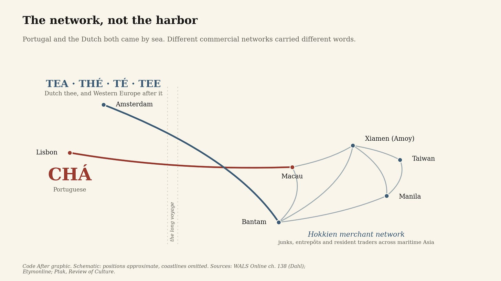
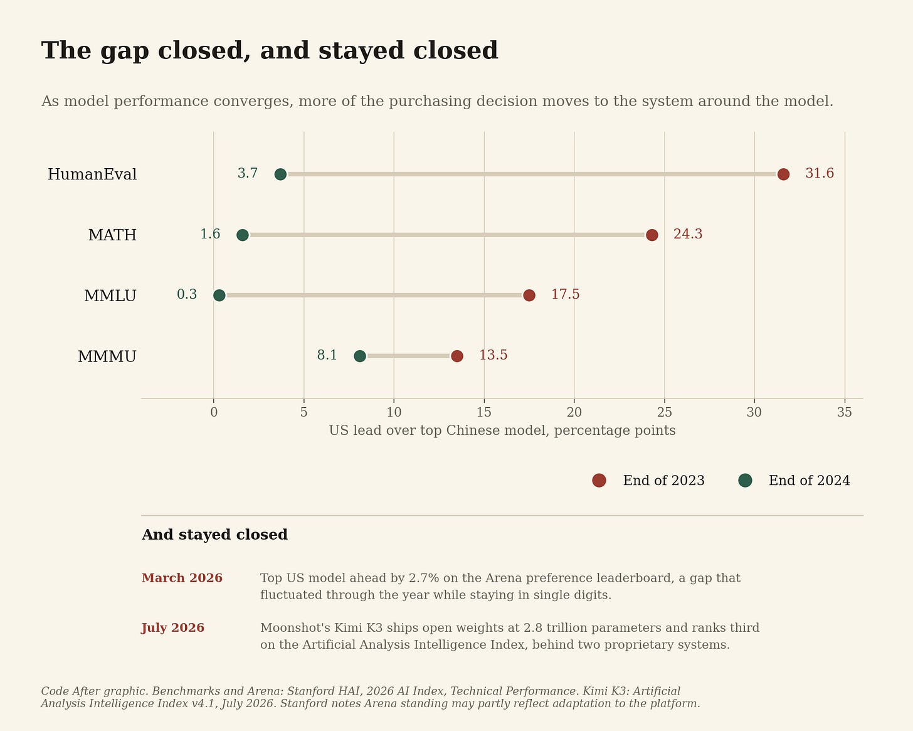
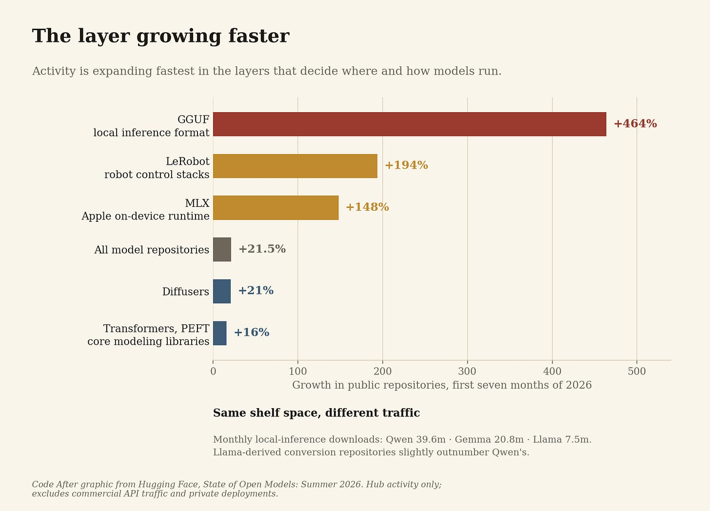

# The Word Remembered the Route

*Most of Western Europe says some version of tea. Portugal says chá. Four centuries later, the route is still audible.*

Walk into a café in London and order tea.

Paris: thé. Madrid: té. Berlin: Tee.

Cross into Portugal and the word changes.

Chá.

The leaf did not change. The route did.

Most of the world’s words for tea descend from two Chinese pronunciations of one character, 茶. One sounds broadly like cha. The other, from the Min languages of China’s southeast coast, sounds closer to te. The Portuguese reached Chinese tea through Macau and brought chá home. The Dutch took the Min form, thee, and Dutch commerce carried it across much of Western Europe: English tea, French thé, Spanish té, German Tee. Along the overland routes the other family prevailed: Russian chai, Persian cha, Greek tsai, Arabic shay, Turkish çay.

There is a better detail.

English had chaa before it had tea. The Portuguese-derived form appears in English records in the 1590s. The form that eventually won came later, on Dutch ships, because the Dutch East India Company became the chief importer of the leaf into that part of Europe from 1610.

Four centuries later you can still hear which network prevailed. That is what path dependence sounds like.

## The map breaks on Portugal

The tourist version of this history is beautifully simple. Tea traveled overland and became cha. Tea traveled by sea and became te.

Portugal came by sea.

The usual repair is Macau against Amoy: the Portuguese met the cha form in a Cantonese-speaking port while the Dutch dealt with the Min-speaking commercial world of Fujian. That repair is also too tidy. The Dutch never had to stand in Amoy to acquire a Fujianese word. Hokkien merchants had built trading networks through the ports of Southeast Asia, and the Dutch bought tea from Chinese junks sailing into Bantam in Java years before regular cargoes reached Amsterdam. The etymology preserves the chain: Min te, directly or through Malay teh, into Dutch thee.

So the determining variable was not the harbor. It was the network.

Same leaf. Overlapping waters. Different commercial interface. The word did not record where a particular ship anchored. It recorded the network through which the product became ordinary.

And the network outlived nearly everything around it. Trading companies dissolved. Commercial advantages expired. Empires ended. China changed beyond recognition.

The word stayed.

## We are watching the wrong layer

We are making a comparable set of choices with artificial intelligence, and we still describe them through the product. Who has the best model. America or China. Closed or open. One laboratory or another.

That question is losing its usefulness.

The compression happened fast and then held. At the end of 2023 the American lead stood at 17.5 percentage points on MMLU, 24.3 on MATH and 31.6 on HumanEval. By the end of 2024 those gaps were 0.3, 1.6 and 3.7. Stanford’s 2026 AI Index, published in April, puts the leading American model 2.7 percent ahead of the leading Chinese model on the Arena leaderboard as of March 2026, and describes a gap that fluctuated through the preceding year while staying in single digits.

Those are two different instruments and should not be read as one series. Arena ranks human preference rather than auditing capability, and Stanford notes that leaderboard standing may partly reflect adaptation to the platform. Both caveats are real. Neither disturbs the point, because what matters here is not the precise margin but that it stopped being decisive.

The argument does not require American and Chinese models to become identical. It requires buyers to have several systems good enough for the surrounding package to enter the decision.

When one technology is far better, everyone buys the better technology. When several are good enough, the route starts to decide.

The United States is explicit about this. Its AI export policy proposes a full-stack package: chips and servers, data-center infrastructure, cloud and networking, data systems, models, cybersecurity, applications. The same order states a separate objective, that American technologies, standards and governance models be adopted worldwide.

Read those two things together. The package is the instrument. The adoption of standards is the purpose. What is being exported is not intelligence but an environment in which intelligence runs.

That is a route, described by the people building it.

## What the community built

China’s route is developing differently, and the difference should not be caricatured as closed America against open China. American companies release open weights. Chinese companies operate proprietary services. Both ecosystems contain both. Of 178 Chinese releases above 20 billion parameters in 2026, Hugging Face counts 59 percent carrying Apache licensing.

But something else is visible in the data.

In July 2026 Moonshot released Kimi K3 at 2.8 trillion parameters, opening the full weights on the twenty-seventh as roughly 1.4 terabytes on Hugging Face. It ranks third on Artificial Analysis’s Intelligence Index, behind two proprietary systems, and became the first Chinese model to top a major coding leaderboard. Frontier capability now ships as a download.

Which is where the essay’s argument starts, rather than ends. A 1.4-terabyte checkpoint is available to everyone and runnable by almost nobody without the surrounding apparatus. What decides who benefits is not access to the weights. It is whether an organization has built the layer that can hold them.

Hugging Face’s Summer 2026 report counts 151,448 derivative models built on the Qwen family, growing by 180 to 210 new repositories a day.

Read the next number carefully, because it holds the mechanism.

Of the 28,531 GGUF conversions of Qwen models the Hub hosts, Qwen itself published 54.

Almost none of that ecosystem was built by the company that owns the model. Nobody in Lisbon designed Portuguese around a tea strategy either.

The same report supplies a second measure. Qwen models generate 39.6 million local-inference downloads a month, against 20.8 million for Gemma and 7.5 million for Llama. That gap is not a shortage of models on the shelf: Llama-derived conversion repositories slightly outnumber Qwen’s. Similar supply, a fifth of the traffic.

Repository count does not explain adoption. Something else did.

## The layer growing faster

Now look one layer outward.

Over the first seven months of 2026, public model repositories on the Hub grew 21.5 percent. Repositories declaring GGUF, the format behind most local inference, grew 464 percent. LeRobot, which connects models to robotic systems, grew 194 percent. Apple’s MLX framework grew 148 percent. The core modeling libraries grew 16 and 21 percent.

Do not read those figures as a census of artificial intelligence. They describe activity on one platform, and Hugging Face says plainly that its download counts miss commercial API traffic, private deployments and everything distributed elsewhere. Take them as a window rather than a survey.

The window still shows the shape. The layers that determine where a model can physically run and what it can act on are expanding several times faster than the modeling core.

The product is moving quickly. The interface around it is moving faster.

## Crossing does not erase the route

Traffic between the two ecosystems is already heavy. Chinese models run on American hardware. Chinese developers use American clouds. American laboratories release open weights, and some large American open-model releases this year build on Chinese work, though the same report names substantial original American releases alongside them. Meanwhile Chinese open models are increasingly optimized for domestic chips, which is the same competition running in reverse.

If these routes were national barriers, that crossing should dissolve them. It does not. Components cross while ecosystems stay recognizable.

Tea did the same thing. It did not remain in Portuguese or Dutch hands. Merchants copied merchants, networks overlapped, buyers changed suppliers, and eventually everyone traded with everyone.

The residue survived anyway.

## What routes leave behind

It is more useful to think in route archetypes than in national systems.

One begins with service: cloud, API, proprietary frontier model, centralized upgrades, security and data rules organized around an external provider. The other begins with possession: downloadable weights, local deployment, fine-tuning, hardware choice, internal inference, more of the intelligence layer under the user’s control. America contains both. China contains both.

But starting with one rather than the other teaches an organization to do different things. A company built around APIs becomes good at orchestration, integration and vendor management. A company built around open weights develops internal capacity in inference, optimization and modification.

Neither is better. They build different muscles.

The muscles are the point, because models get replaced faster than organizations relearn how to work. The first cohort of developers becomes the next cohort of managers. A procurement standard becomes an installed base. A hardware constraint becomes a training curriculum. A data-location decision becomes an architecture, and the architecture becomes a regulatory assumption. No single choice is irreversible. Together they make switching something other than a model decision.

The interface survives the product.

## How a technology acquires geography

We remember diffusion as the movement of an invention. Electricity spread. Railways spread. Telecommunications spread. The internet spread.

Inventions do not travel naked. Electricity arrived with frequencies, voltages, sockets and utility structures. Railways arrived with gauges. Telecommunications arrived with standards, numbering systems, equipment vendors and operators. Some of those choices vanished. Others became the floor everyone else had to build on.

Tea left something smaller than any of them. A word.

That is precisely why the word is useful evidence. No regulator required Portugal to preserve chá. No standards body defended it. No company retained any interest in how Portuguese speakers pronounced it. The route became habit, habit became language, and the language outlasted the route.

## The test

Most countries are answering a smaller question than alignment with Washington or Beijing. It is operational, it is being answered this year, and it is mostly being answered without anyone noticing that a durable choice is being made.

Through which interface does AI become ordinary here?

Cloud or local. API or weights. Foreign infrastructure or domestic. Office productivity first or industrial deployment first. Centralized upgrades or local modification. Imported applications or domestic engineering.

The answers will differ by country, company and sector, and they should. They will also compound. Today’s developer tools become tomorrow’s skills base. Today’s preferred model family becomes tomorrow’s application ecosystem. Today’s deployment pattern shapes tomorrow’s regulation, because institutions govern what is actually in front of them.

Here is the prediction. By the middle of the 2030s, countries with access to models of broadly comparable capability will possess visibly different AI economies. Those differences will not be explained by which country trained the strongest model. They will track the route intelligence took when it first became infrastructure.

The claim is testable. If capability keeps converging and countries that adopted through different routes also converge in deployment architecture, developer skills, infrastructure dependence and patterns of local modification, then the route did not matter and this essay is wrong. If today’s originating models are obsolete a decade from now and their routes remain legible in infrastructure, skills and institutions, then something more durable happened.

I expect the second, because we have heard it before.

Portugal still says chá. The trading companies are gone. The empires are gone. The advantage that produced the route expired four hundred years ago.

The route remained in the word.

We should be paying closer attention to what today’s routes are leaving behind.

---

**Sources**

Östen Dahl, “Tea,” _WALS Online_, Chapter 138.

Douglas Harper, _Etymonline_, entry for “tea.”

Roderich Ptak, “The Chinese, the Portuguese and the Dutch in the Tea Trade between China and Southeast Asia (c. 1600–1750),” _Review of Culture_ (Macau, Instituto Cultural); German original in _China’s Seaborne Trade with South and Southeast Asia (1200–1750)_, Ashgate/Variorum, 1999.

_Dictionary of Traded Goods and Commodities 1550–1820_, entry for tea, British History Online.

Stanford HAI, _2026 AI Index Report_, Technical Performance chapter, April 2026.

The White House, _Promoting the Export of the American AI Technology Stack_, July 2025.

Hugging Face, _State of Open Models: Summer 2026 Observations_, August 14, 2026.

Artificial Analysis, _Intelligence Index_ v4.1, July 2026; Moonshot AI, Kimi K3 release and technical report, July 16 and 27, 2026.