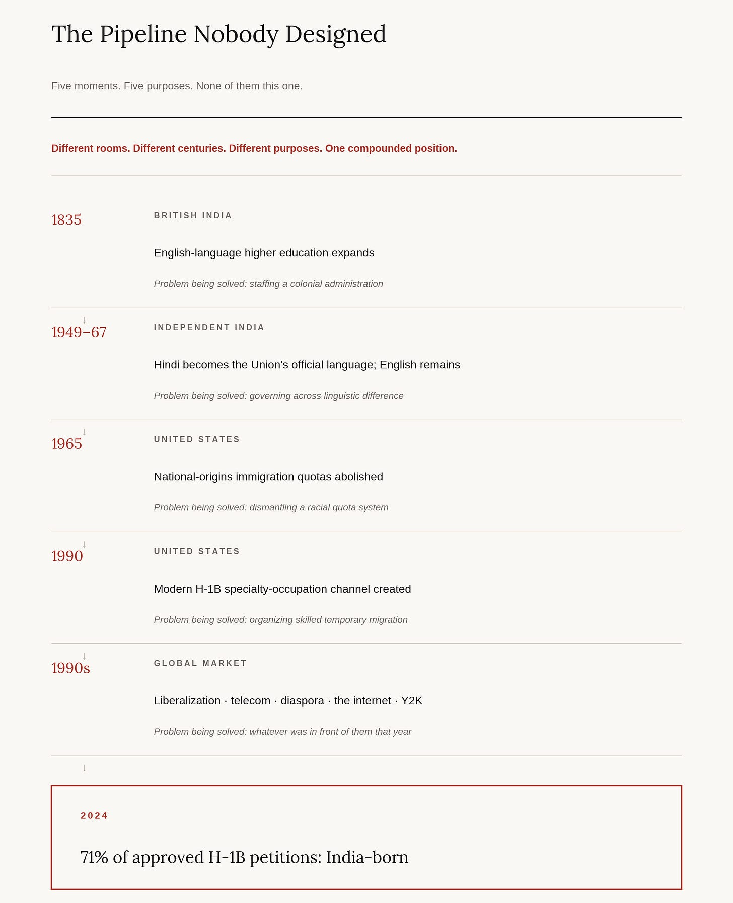
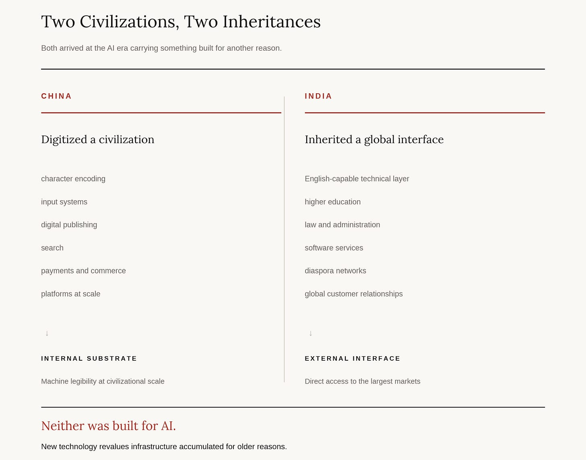
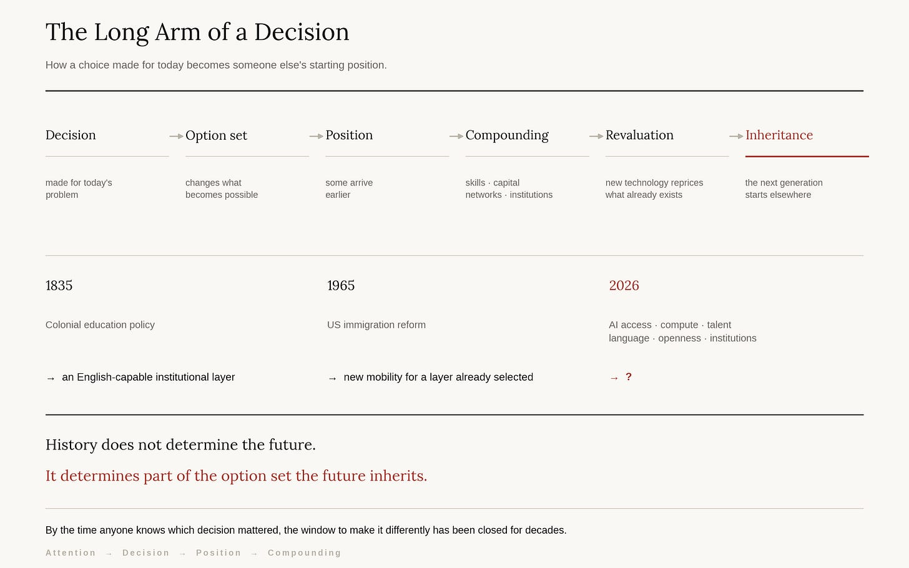

# The Language That Stayed

>A colonial staffing decision, an Indian constitutional compromise, and two American immigration laws assembled a pipeline that none of them intended.

One number is worth holding onto through the current American argument about skilled immigration.

Of all H-1B petitions approved in fiscal 2024, 71 percent were for people born in India. China came second at just under 12 percent. The remaining eight countries in the top ten accounted for about 7 percent between them. Nearly two-thirds of all approvals were for computer-related occupations.

That number does not say Indians make better engineers. It says a pipeline exists, and it says where the pipeline was laid.

The usual explanation is English. India has an unusually large pool of engineers and professionals who can work directly inside the language of American business and technology. That is true, and it is where most accounts stop, which is a shame, because English in India is the thing that needs explaining rather than the explanation.

Roughly nine out of ten Indians did not report English among their first three languages in the 2011 Census. The country that supplies most of America’s skilled-worker program is not, by population, an English-speaking country and has never been one.

The answer runs through decisions taken in 1835, 1949, 1963, 1967, 1965 and 1990. Some were imposed. Some were negotiated. One was forced from the street. Two were taken in another country entirely. Not one was taken with a technology industry in view, and several were taken by people who would have been appalled by each other.

This is what the series means by ancestors. History does not determine the future. It determines part of the option set the future inherits.

## The first decision was imposed

English did not arrive in India as a development program.

The East India Company’s earlier posture had leaned the other way. British officials studied Indian languages. Persian held a long-standing role in administration and the courts. Colonial government ran on existing linguistic systems because it had no alternative.

Then the policy turned. In February 1835, Thomas Babington Macaulay wrote his Minute on Education, arguing for the formation of a class of intermediaries between the British administration and the population it governed: Indian in blood and color, English in taste and intellect. State support shifted toward English-medium Western higher education. Within a few years Persian lost much of its official role, replaced in different jurisdictions by English and by Indian vernaculars.

The purpose was hierarchical and it was explicit. This was a staffing strategy for an empire. Macaulay was not designing modern India, and he could not have imagined Bangalore.

That distinction is the whole point of this series, so it is worth stating without sentiment. A railway does not keep the politics of the government that laid the track. A legal system does not vanish with its sovereign. A language outlives the reason power taught it. The builder controls the first use. History takes the rest.

## The second decision was a compromise, written with a door in it

Independent India inherited English and had every reason to replace it. The difficulty was with what.

India’s linguistic map is not a set of regional accents. Indo-Aryan languages dominate much of the north. Tamil, Telugu, Kannada and Malayalam belong to the separate Dravidian family and dominate much of the south. Other Indian languages belong to other families still. Centuries of contact produced heavy borrowing in both directions, and the genealogical distance survived all of it. Hindi was not a variant of what a Tamil speaker already knew.

That turned language into a distribution question. Making Hindi the sole language of the Union would not impose the same cost on every Indian. A native Hindi speaker would enter national examinations, administration, law and politics holding an advantage that a Tamil or Malayalam speaker had to buy with years of study. The argument was never simply English against Hindi. It was about which Indian linguistic community would carry the cost of national standardization.

After prolonged argument, the Constituent Assembly adopted its compromise in September 1949. Hindi in Devanagari became the official language of the Union — not the national language, which the Constitution declines to name to this day. English would continue for official purposes for fifteen years.

Here the popular account goes wrong, and the correction improves the story.

Article 343 did not order English to leave in 1965. Clause 3 of the same article expressly empowered Parliament to provide for its continued use after the fifteen-year period. The deadline and the escape hatch were written into a single article by the same people on the same day. They settled the direction and deferred the endpoint, because the endpoint was the part they could not agree on.

And English held one political advantage that no Indian language could hold. No major Indian linguistic region could claim it as its own. That did not make English socially neutral — access to it was unequal then and is unequal now. It meant something narrower and more useful: retaining English did not hand one large Indian region the permanent native-speaker advantage that adopting Hindi alone would have.

Not neutrality by equality. Neutrality by foreignness.

## The third decision was forced from the street

Parliament passed the Official Languages Act in 1963, before the fifteen years expired, to let English continue. That settled the law and not the politics.

As January 1965 approached, fear of Hindi imposition produced mass protests in what was then Madras State. Students led them. Violence and state repression followed and people died; casualty counts vary enough across sources that the number is less useful than the outcome. Tamil politics never returned to what it had been.

The settlement that emerged was considerably more durable than the one it replaced. The 1967 amendment provided that English would continue until every state that had not adopted Hindi passed a resolution agreeing to discontinue it, followed by resolutions in both houses of Parliament. That is a threshold engineered not to be crossed.

English had now changed function three times. An instrument of colonial administration. Then a term in a constitutional bargain. Then, by way of resistance to an Indian language, a durable bridge across India’s own differences.

Nobody involved at any stage was building an export industry. Each generation was solving the problem in front of it. That is how ancestors are made.

## In the same year, a door opened on the other side

The decision missing from most tellings of this story was taken somewhere else entirely.

In 1965, as India’s language settlement faced its first real test, the United States rebuilt its immigration system. The Immigration and Nationality Act abolished the national-origins quotas that had favored European migration for four decades. What replaced them was mostly a family-based preference system, with narrower channels for skills and occupations.

The law was not designed to build an Indian technology elite in America. It did something more elementary. It removed a filter that had kept most of Asia out.

The Indian-born population in the United States before that law was very small. It grew quickly afterward, and the arrivals were disproportionately young, urban, educated and comfortable in English. America was not receiving a random sample of India. Its immigration system was drawing from one layer of it.

Twenty-five years later a second American decision made the channel explicitly technical. The Immigration Act of 1990 reorganized skilled temporary migration and created the modern H-1B specialty-occupation category.

The link to American universities is now visible inside the USCIS data. Among the FY2024 approvals for new employment that requested a change of status — a much narrower category than the headline figure, about 74,000 petitions — roughly seven in ten came from people previously holding F-1 or F-2 status, the classifications covering international students and their dependents. The skilled-worker channel is fed by the university channel, which is fed by the ability to study in English.

British imperial staffing policy created an English-educated layer. Indian domestic politics kept that layer’s working language inside national institutional life. American civil-rights-era reform removed the racial filter. American universities became a second selection layer. American skilled-worker policy built a channel shaped to professional and technical labor.

No one designed the chain. Decades later the links coupled.

## The advantage was never that India speaks English

The census makes the arithmetic plain. About 10.6 percent of the population reported English among their languages in 2011, against 57 percent for Hindi. Two-hundredths of one percent claim it as a mother tongue. A later nationally representative survey put self-reported speaking ability lower still.

The advantage was arithmetic rather than cultural. Ten percent of 1.2 billion people is roughly 128 million, larger than the population of Japan. A thin layer on a subcontinent is an enormous absolute pool, and an export industry does not need a nation. It needs enough engineers, managers and entrepreneurs who can read a specification, join a call and write a commit message. India had that layer at a scale no comparably positioned country could match.

Its composition is the part usually left out, and it belongs in, because this was never an evenly distributed national inheritance. English competence in India tracks schooling, wealth, urban residence and caste closely. Upper-caste respondents are roughly three times as likely to report speaking English as respondents from scheduled castes and scheduled tribes, who are about a quarter of the population, and the gradient by income is steeper still.

English was an advantage. Access to English was also a privilege. American immigration and university systems then selected disproportionately from the people already more likely to hold that privilege. The pipeline compounded the selection.

That does not weaken the argument. It tells you what kind of advantage this was. An inherited asset reaching a tenth of a population transformed a country of that size and left most of that country outside it.

## Then the market found what history had assembled

None of this, on its own, creates a software industry. Several other things had to arrive first.

Engineering education at scale, where the degree functioned as much as a screening device as a curriculum. Economic liberalization. Software-export policy. Cheap satellite and undersea capacity, which made it possible to move the work instead of the worker. Diaspora networks in the United States supplying introductions and, more valuably, trust. The internet.

And then an accident with a date attached. As 2000 approached, enormous demand appeared for the unglamorous work of finding and repairing date handling in legacy systems — much of it written in COBOL, a language Indian institutions still taught and American computer science departments had largely stopped teaching. Software exports crossed a billion dollars in 1997 and were several times that within four years. The remediation work itself was temporary. The client relationships, the delivery experience and the credibility were not.

English was one part of the substrate. Engineering education was another. Telecommunications, policy and diaspora networks were others. Y2K was the shock that suddenly revalued the whole assembled stack.

The internet reduced the cost of distance. English reduced the cost of the interface. For one layer of India, the largest transaction cost in global services trade had already been paid, decades earlier, by people arguing about something else.

## Two civilizations, two accidents

An earlier essay described a different inheritance in China. Decades of work making Chinese computable — character encoding, fonts, input methods, sorting, publishing, search, and eventually payments, commerce and communication at enormous digital scale. Work begun for the computer era, inherited by the model era. Nobody encoding Chinese characters in 1994 was assembling a training corpus.

India’s inheritance ran in the other direction.

China digitized a civilization. India inherited a global interface.

China’s advantage is broad and internal: a vast native-language and commercial world made legible to machines. India’s was narrower and external: a layer of the population able to connect directly to the language of the world’s largest software and professional-services markets.

Neither was built for artificial intelligence. Both arrived at the AI era after decades of compounding.

## The interface is being commoditized by what came next

Here is the turn, and it is why this belongs in this series rather than in a business magazine.

English gave part of India a relative advantage because crossing the language barrier was expensive and that layer had already paid most of the cost. Machine translation, multilingual models and voice interfaces are reducing that cost for everyone else. A Vietnamese engineer, a Brazilian founder and a Chinese manufacturer will increasingly work across markets without the fluency an earlier generation bought with years of schooling.

Interface advantages erode when technology makes the interface cheaper. AI is beginning to do that to language.

The accumulated returns do not erode with them. India has already converted four decades of English-mediated access into technology companies, engineering schools, customer relationships, management depth, diaspora networks, capital and millions of careers. The linguistic edge was temporary. The position built while it lasted is not.

Rate mattered. Position compounded.

And a second inheritance sits underneath. India recognizes twenty-two scheduled languages, with many more spoken, several major scripts, and wide variation in literacy and digital access. That description of a coordination problem is also a close description of the problem artificial intelligence faces outside English. Making machine intelligence useful across languages, scripts, accents and literacy levels is not obviously the wrong problem for a country that has spent seventy-five years administering itself across exactly those differences.

It guarantees nothing. But the condition that once made a foreign bridge necessary may prove more durable than the bridge.

## What none of them knew

Macaulay was staffing an administration.

The Constituent Assembly was governing a multilingual country without handing one region a permanent advantage, and writing an escape hatch into the same clause as the deadline because it knew the deadline would not hold.

The students in Madras in 1965 were defending their own language against another Indian one. They would have been baffled to learn that a talent pipeline for California is among the things they accomplished.

The United States Congress that year was dismantling a racial quota system. The Congress of 1990 was reorganizing work visas. The engineers fixing date fields in 1998 were fixing date fields.

There is a tempting way to read that list, and it is wrong. None of those decisions produced the outcome. History does not run in a line from Macaulay to Bangalore to Silicon Valley. Remove any single link and the picture changes rather than collapses; remove several and it is unrecognizable. What each decision did was change the starting conditions inherited by whoever came next. Later markets and technologies did the compounding.

Institutions transmit advantages, constraints and options. They do not transmit outcomes.

Which is the part that applies now. The decisions being taken this year about who reaches advanced models, how talent crosses borders, which languages receive investment, where compute is built, what stays open, and which institutions form around this technology will outlast the product cycle they are being argued about in. Most will disappear. Some will fail. A few will become the ground the next generation stands on. Some arrangement that looks like a temporary compromise in 2026 will still be shaping who is in position in 2066.

There is no way to know which one. No amount of foresight would have told the men in that Assembly either, because the value of what they were preserving depended on an industry that would not exist for forty years.

That uncertainty is usually offered as a reason to wait. It is the reason not to. Nobody can identify in advance which decision history will revalue, which is exactly why the interval in which any of them remains reversible is the only thing anyone controls. Position compounds while the argument runs.

Last Monday’s essay argued that attention is not preparation. This history supplies the step after it. Attention has to become decisions while the decisions are still open.

A public that arrives late does not get to choose badly.

It does not get to choose.

The fifteen years ended in 1965. The inheritance did not.

---

_Sources: Constitution of India, Article 343. Constituent Assembly Debates, September 1949. Official Languages Act 1963 and Official Languages (Amendment) Act 1967. Macaulay’s Minute on Education, 2 February 1835. Census of India 2011, language tables. Lok Foundation–Oxford University survey. Immigration and Nationality Act of 1965; Immigration Act of 1990. USCIS, Characteristics of H-1B Specialty Occupation Workers, Fiscal Year 2024. Contemporary industry and academic accounts of Indian software export growth and the Y2K period._
