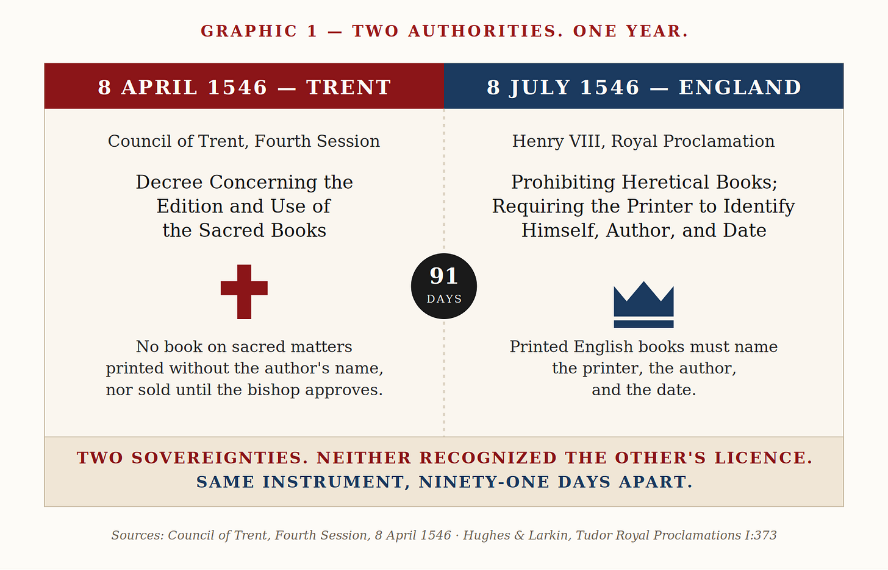
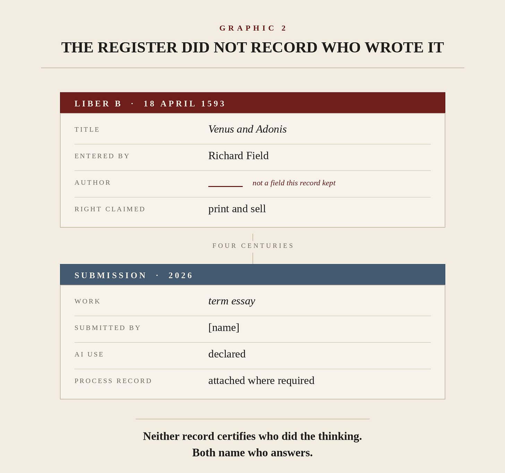
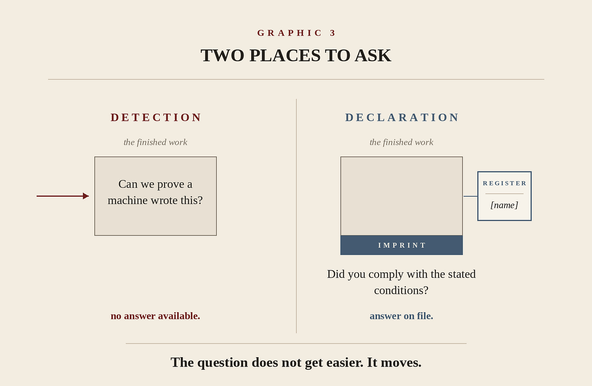

# The Imprint

>I detectors ask the finished work to confess how it was made. In 1546, two rival authorities put that information somewhere else.

An **AI Has Ancestors** essay. The series reads AI as the fifth member of a family of encoding technologies: writing, the alphabet, the press, the wire. An ancestor teaches more than once, and this is the press’s second lesson. The full framework and the Code After Series are at [codeafter.ai](https://codeafter.ai/).

On August 25, MIT published the report of its Ad Hoc Committee on AI Use in Teaching, Learning, and Research Training. The Institute’s president called the moment a watershed. Inside a document about curriculum, assessment, and residential life sits a governance decision with a five-century precedent, and the coverage has not noticed which one.

The committee told instructors to stop relying on AI detectors.

Its reasons are practical. Students answer detection with humanizers, and the exchange becomes an arms race that consumes effort on both sides and settles nothing. Detection systems mistake the writing of non-native English speakers and neurodivergent students for machine output, and even a low false-positive rate carries serious consequences for the student it lands on. Policing builds an adversarial atmosphere of distrust. MIT’s own Committee on Discipline does not treat detector output alone as sufficient to bring a case.

What the committee puts in its place reads, at first, like a retreat from enforcement. Every subject carries a written AI policy, posted, stating when AI is required, permitted, or prohibited, with the reasoning attached. Instructors disclose their own use. Every thesis carries a statement of how AI was used, and AI is never listed as a co-author. Where it helps, students work on platforms that record version history and submit that history with the finished work.

The retreat reading is wrong. This is a change of instrument, and the instrument is old.

## **The artifact stopped answering**

A detector examines a finished text and tries to reconstruct the process that made it. The questions it would need to answer are not binary. Did the student form the argument while a model organized it? Did the model find the sources the student then read and judged? Did the student write every sentence and ask a model to tighten them? Did the model produce a draft the student broke apart and rebuilt? Those are four different acts with four different claims to credit, and the finished page records none of them.

This is not a complaint about the current generation of detectors. Better ones are coming, and watermarking will do real work in particular settings. The fact underneath is that human and machine production have grown into each other, and a verdict on the final object answers a question nobody is asking.

We are asking the page to testify about its own manufacture. It was never built to do that.

Institutions have met this exact fact before, at the moment a technology first let identical work circulate at scale with nobody answerable standing anywhere near it.

## **1546, twice**

Print did not invent anonymity. Texts had circulated unsigned, miscopied, and misattributed for as long as texts existed. What print changed was scale and fidelity together: hundreds and then thousands of near-identical copies moving through a market while whoever set the type stayed in a shop in another city. The words traveled without their maker, and reading the words stopped being a way of finding him.

Two authorities reached the same instrument in the same year.

On April 8, 1546, the Council of Trent, in its fourth session, complained that printers were issuing books with the press unnamed or under a fictitious name and, worse in its view, without the author’s name. It decreed that no book on sacred matters be printed without its author’s name attached, and none sold or kept until examined and approved by the bishop.

Ninety-one days later, on July 8, 1546, Henry VIII issued a proclamation against heretical books requiring the printer of an English book to put his own name on it, together with the author’s name and the date of printing.

On which books to suppress, the two would frequently have agreed. Henry’s proclamation banned the New Testaments of Tyndale and Coverdale by name, and Rome would have burned both. Their quarrel was never about that. Trent vested approval in the bishop, under an authority Henry had spent a decade dismantling in England and relocating to the Crown. Neither recognized the other’s licence. They ran incompatible legal systems, in different languages, with no shared enforcement and no shared idea of who was entitled to permit a book at all.

And within a single season, both reached past the object for the same fix: stop trying to read the work, and make the production name itself.

The instrument was invariant to the quarrel. That is the evidence. A mechanism that rival sovereignties arrive at independently of their disagreement is being forced by the technology rather than chosen by the politics.

## **The Register did not record who wrote it**

England built the instrument out into an architecture. In 1557 the Crown granted the Stationers’ Company a royal charter with extensive authority over printing, and from that point titles were entered in the Stationers’ Register, which ran, with one gap, until 1911.

On April 18, 1593, _Venus and Adonis_ was entered in the Register’s Liber B by Richard Field, a printer from Stratford-upon-Avon. Shakespeare’s name does not appear in the entry. Field’s does.

This is not a mystery about authorship. The first edition carried a dedication to the Earl of Southampton signed with Shakespeare’s name, and its title page read _Imprinted by Richard Field_. Authorship was on the object, offered voluntarily, one leaf in. What the Register held was a different fact: a claim, and a name against it. This stationer holds the right to print and sell this title, and here is who holds it.

That is a ledger, not a certificate of authorship. And it produced something the certificate could not have produced — a standing record of who was answerable.

The pairing is the architecture. The imprint on the page named the party the law could reach. The Register in the hall recorded what that party held and when he came to hold it. One instrument for enforceability, one for representation, working on an object that had stopped being legible on its own. Law and accounting, doing what they do whenever the world starts producing things institutions cannot see into.

The rules hardened. The Star Chamber decree of July 11, 1637 required entry in the Register before printing and required printed matter to carry the names of printer and author. The Licensing Act of 1662 restored that regime after the civil wars.

England had built what we would now call metadata: the text one thing, the record of how the text entered the world another, held separately and enforced separately.

## **People lie**

The obvious objection is that declaration is weak. Printers omitted their names. Publishers evaded the Register. A student states that no AI was used, and it is not true.

All of that happened, and unauthorized printing never stopped. But declaration changes what the institution has to prove.

Without it, a university accuses a student on the strength of an inference about how a piece of writing feels. With it, the institution sets the rule before the work begins and puts the obligation on the person submitting it. The question stops being _can we prove a machine wrote this_ and becomes _did you comply with the stated conditions under which this work was to be produced_. The first question has no answer. The second is the kind of question institutions have handled for four hundred years.

Authorship and answerability are different things. The press taught that once. AI is teaching it again.

## **The imprint names the press, not the reader**

There is a reason the printing precedent bites harder than it looks.

An imprint identifies the party operating the technology. It was never a rule about consumers. Much university AI policy so far has been written as though AI were something students do to institutions, and the MIT committee is direct about the cost: students watch instructors use AI for assignments, feedback, and grading while student use is restricted, and they read it as a double standard. The committee’s recommendation runs both ways, which is why it works. If a student is expected to state that a model restructured an essay, an instructor is expected to state that a model wrote the feedback on it.

The seventeenth-century question was who put this into circulation. The twenty-first-century version is who did what.

## **The record beside the work**

One recommendation in the report has drawn almost no attention and is the closest thing in it to the Register. Students work on platforms that capture version history and submit that history with the work. The committee calls it process evidence, and the term is exact. A version history establishes nothing about who did the thinking. It can be fabricated, and an institution that treats it as proof will get the same arms race in a new medium, with manufactured revision trails standing in for humanizers.

What it does is make a process legible. An essay that appeared in four minutes, where comparable work takes hours, is legible in a way the essay itself is not. That is the same move, five centuries later. Stop interrogating the object. Keep a record beside it, and attach a name to the record.

The lineage is not one to inherit whole. The Stationers’ system braided recordkeeping with censorship, monopoly, and Crown control, and the Star Chamber is not a model of anything. The Licensing Act lapsed in 1695, and by 1710 registration had been turned toward the author’s property rather than the printer’s obligation, which is a later essay in this series.

What survives the regime is the mechanism. When a technology moves the activity that matters out of the place institutions were looking, the institutions that last stop measuring the old observable and build a new one. Detection is the old observable. So is the page. The question is what replaces them, and who keeps it.

## **Who holds the register**

Universities are ahead on this because the places to put the record already exist. MIT has a syllabus, a submission system, a thesis deposit, and a disciplinary committee that has already ruled on what evidence counts. The Institute does not need to invent an institution. It needs to change what its existing ones record.

Everyone else has registers too, and that is the part worth worrying about. An audit has a signed opinion and workpapers. A court has filings, certifications, and a docket. A lender has a credit file and an approval chain. A hospital has a medical record with named clinicians attached to every decision. Each of those is a register in the sense the Stationers would have recognized: a record held beside the work, naming who answers for it.

None of them currently records what the term essay is now being asked to record. Who ran the model. On what. What the human checked. Who made the judgment, and who answers when the judgment is wrong. The registers exist. They are silent on precisely the question that has become live.

That silence will not be repaired by reading the linguistic texture of an audit opinion and guessing whether a machine touched it. That is the detector mistake at institutional scale, and it is where most of the professions are currently heading.

MIT has taken the other road first. Do not make the artifact confess. Make the production declare itself, and put a name on the record.

A declaration is worth exactly what the venue that enforces it is worth. Universities have a venue. The question for every other profession is what theirs is, and who is going to say so.

_Read it. Be hard on it._

---

**Notes and Sources**

_Sources for Graphics 1 to 3 and for all historical statements in the essay._

**Primary documents**

Council of Trent, Fourth Session, 8 April 1546. _Decree Concerning the Edition and Use of the Sacred Books_. English text from J. Waterworth, trans., _The Canons and Decrees of the Sacred and Oecumenical Council of Trent_ (London: Dolman, 1848).

_A Proclamation Prohibiting Heretical Books; Requiring the Printer to Identify Himself, Author of Book, and Date of Publication_, 8 July 1546. In P. L. Hughes and J. F. Larkin, eds., _Tudor Royal Proclamations_, vol. 1 (New Haven: Yale University Press, 1964), 373.

Royal charter to the Worshipful Company of Stationers, granted by Philip and Mary, 1557.

Stationers’ Register, Liber B: entry for _Venus and Adonis_, 18 April 1593, entered by Richard Field. Stationers’ Company Archive, TSC/F/01/01. Transcribed in Edward Arber, ed., _A Transcript of the Registers of the Company of Stationers of London, 1554–1640_, 5 vols. (London: privately printed, 1875–94), 2:630. The Register series runs from 1557 to 1911, with a gap between 1571 and 1576.

William Shakespeare, _Venus and Adonis_ (London: Imprinted by Richard Field, 1593). Shakespeare’s name appears at the foot of the dedication to Henry Wriothesley, Earl of Southampton, on the dedicatory leaf. Bodleian Library, Arch. G e.31(2); ESTC S102412.

_A Decree of Starre-Chamber, Concerning Printing_, 11 July 1637 (London: Robert Barker and the assigns of John Bill).

_An Act for Preventing the Frequent Abuses in Printing Seditious, Treasonable and Unlicensed Books and Pamphlets, and for Regulating of Printing and Printing Presses_, 1662. Lapsed 1695. Followed by the Statute of Anne, 1710.

_Report of MIT’s Ad Hoc Committee on AI Use in Teaching, Learning, and Research Training_, dated 13 August 2026, published 25 August 2026. Sections used: 3.1.8, on course policies stated with a rationale; 3.1.9, on the recommendation against relying on detectors and on version history as process evidence; 3.2.3, on instructor disclosure; 3.2.6, on thesis statements of AI use and on AI never being listed as a co-author. “AI and Education: A Watershed Moment for MIT,” letter, MIT Organization Chart, 25 August 2026.

**Editions and archives carrying the documents**

*Lionel Bently and Martin Kretschmer, eds., Primary Sources on Copyright (1450–1900), copyrighthistory.org. Commentaries by Ronan Deazley on the Star Chamber Decree (1637) and on the Licensing Act (1662). Deazley’s commentary on the Henrician proclamation of 1538 concerns the earlier licensing regime, not the July 1546 proclamation used here.*

*Shakespeare Documented, Folger Shakespeare Library. Adam G. Hooks, “Venus and Adonis, first edition,” [https://doi.org/10.37078/114](https://doi.org/10.37078/114). Ian Gadd on the Stationers’ Register.*

**Secondary literature**

*Adrian Johns, The Nature of the Book: Print and Knowledge in the Making (Chicago: University of Chicago Press, 1998). The essay’s central claim, that provenance had to be built by institutions rather than read off the printed object, is Johns’s argument.*

*Elizabeth L. Eisenstein, The Printing Press as an Agent of Change (Cambridge: Cambridge University Press, 1979). The account of print fixity that Johns writes against, named here so the reader can see the dispute the essay stands inside.*

*Peter W. M. Blayney, The Stationers’ Company and the Printers of London, 1501–1557 (Cambridge: Cambridge University Press, 2013). On the 1557 charter.*

*F. S. Siebert, Freedom of the Press in England, 1476–1776 (Urbana: University of Illinois Press, 1965). Cyndia Susan Clegg, Press Censorship in Jacobean England (Cambridge: Cambridge University Press, 2001). Joseph Loewenstein, The Author’s Due: Printing and the Prehistory of Copyright (Chicago: University of Chicago Press, 2002). L. Ray Patterson, Copyright in Historical Perspective (Nashville: Vanderbilt University Press, 1968). Michael Treadwell, “The Stationers and the Printing Acts at the End of the Seventeenth Century,” in The Cambridge History of the Book in Britain, vol. 4.*

**In this series**

*Grade the Thought (2026), which carries the detector mathematics this essay assumes rather than repeats. AI Has Ancestors, Parts One to Three (2026).*

**Verification and rights**

*Graphics 1 to 3 are typeset reconstructions originated for this essay. No third-party images are reproduced. Images of the Liber B entry and of the 1593 quarto are available from the Stationers’ Company and the Bodleian Library under CC BY-NC 4.0 and are not used here.*