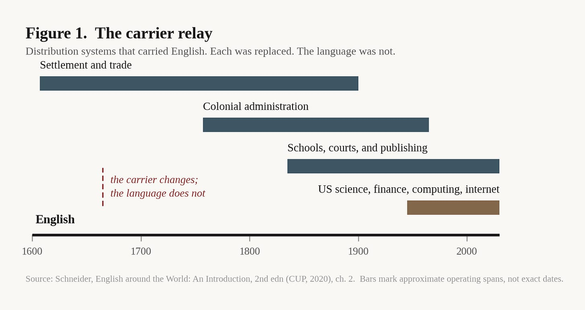
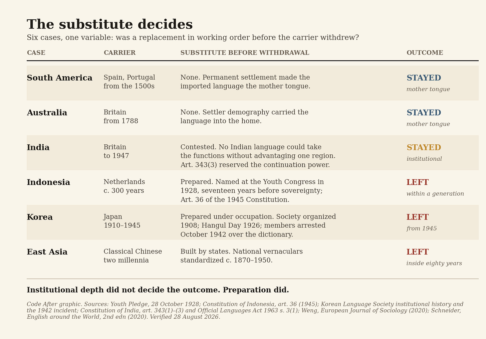
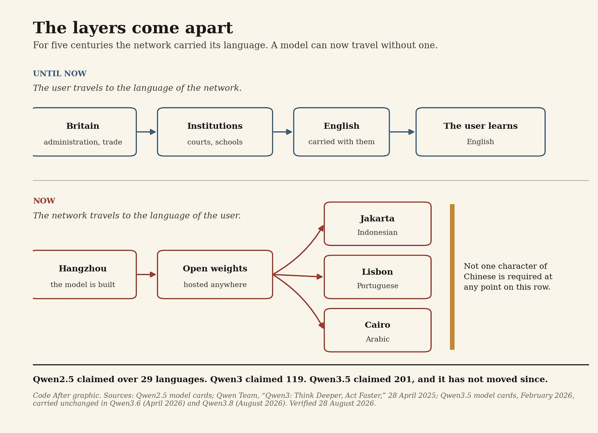
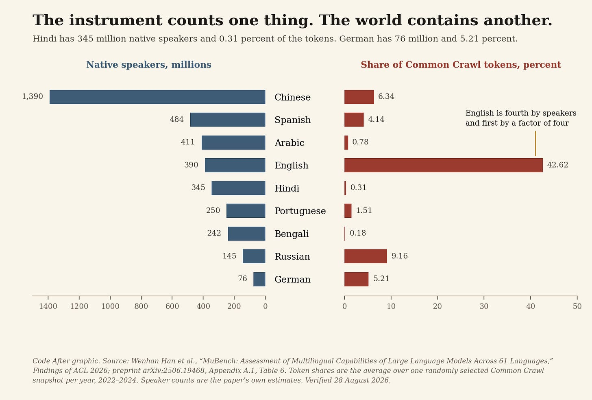

# Who Pays to Cross

>For a thousand years, the cost of reaching a shared language fell on the person reaching. It has moved.

The linguistic map of the world is a strange document.

Spain and Portugal crossed the Atlantic five centuries ago. Spanish and Portuguese are the mother tongues of most of South America.

Britain governed India for under two centuries. English never displaced India’s languages. It sits in the courts, the universities, the statute book, and the corporate registry anyway.

The Dutch governed the archipelago that became Indonesia for three hundred years. Dutch left public life within a generation of sovereignty.

Japan made Japanese the language of schools and administration in Korea for thirty-five years. After August 1945, Japanese went out of those institutions faster than the empire that installed it.

East Asia produced something that resembles none of these. For two millennia, educated Koreans, Japanese, and Vietnamese conducted scholarship, government, and diplomacy in written Chinese without speaking Chinese.

One phenomenon. Languages moving beyond the societies that made them. Five outcomes.

The usual explanation is power. Strong states spread their languages. That explanation survives contact with the evidence and does no work, because every case above involves a strong state and the outcomes diverge anyway.

The question that does work is narrower. What decides whether a language stays after the system that carried it goes?

## Study the pipe, not the language

There is a standing temptation to explain the reach of English by something inside English. Flexible grammar. Easy borrowing. Some native fitness for commerce or code.

History makes that hard to sustain.

French held European diplomacy and elite culture for two centuries. Spanish took a continent. Portuguese ran from Brazil to Angola to Macau. Dutch belonged to the most formidable commercial network of its century.

None of them ended where English ended.

What English accumulated was not a property. It was a sequence of distribution systems, each of which took over as the previous one failed. Migration and trade moved it across oceans. Colonial administration put it into courts and revenue offices. Schools and printing standardized and reproduced it. Then the political carrier collapsed, and a second one was already running: American science, finance, higher education, popular culture, computing, and the networks built on top of them. The scholarship on World Englishes makes the point directly. The global spread of English accelerated after formal empire ended.

The carrier changed. The language stayed.

## One became a mother tongue. One became plumbing

Distribution alone does not explain the map either.

English reached Sydney and Calcutta through the same empire. Australians speak English at home. Most Indians do not.

The difference is demographic. Where large numbers of speakers settled permanently and raised children in the language, the imported language became a mother tongue. Where small administrations governed very large populations, the imported language took the courts, the ministries, the universities, and the commanding heights of advancement, and left daily life alone.

India is the fully documented version of the second outcome, and this series has already spent an essay on it. The short form: Article 343 of the 1950 Constitution made Hindi the official language of the Union, continued English for fifteen years, and in the same article reserved Parliament’s power to continue English after that period. The deadline and the door were drafted together. Parliament walked through the door in 1963, and the settlement that followed the 1965 crisis in Madras made reversal require a resolution from every non-Hindi state.

English in India does not need to displace Tamil, Bengali, or Marathi to hold that position. It holds it because no Indian language could take those functions without handing one region a permanent advantage over the others.

One colonial language became a mother tongue. Another became plumbing.

## The replacement is built before the carrier leaves

If institutional depth settled the matter, every deeply administered colonial language would have survived. Two cases say otherwise, and they say it the same way.

Indonesia had a substitute seventeen years before it had a state. At the Second Youth Congress in Batavia on 28 October 1928, delegates pledged one motherland, one nation, one language of unity. The language they named was Malay, claimed as Indonesian. Article 36 of the 1945 Constitution then made it the language of the state. Dutch had offered schooling, government employment, and advancement for three centuries. It went out of public life within a generation, because something built to replace it was already standing.

Korea did the same work under occupation. The society that became the Korean Language Society was organized in 1908, two years before annexation. It established the commemoration that became Hangul Day in 1926, in the middle of Japanese rule. Its members were arrested in October 1942 for compiling a Korean dictionary. Japanese rule pushed Japanese into schools and administration for thirty-five years and restricted Korean in public. When the occupation ended, Korean walked back into the institutions, because scholars had spent the occupation keeping the replacement in working order. The full transition took decades more, and Chinese characters persisted in Korean newspapers into the 1990s. The direction was never in doubt.

Neither substitute appeared on its own. Jeffrey Weng’s account of the East Asian transitions of 1870 to 1950 argues that the standard diffusionist reading has the causation backward. Language nationalization was state-led and top-down, directed at remaking society rather than following it. Somebody built the replacement, deliberately, and in Korea’s case did it while the occupying power was arresting them for it.

Set the cases side by side and the variable that separates them is visible.

The mechanism is not permanence. It is switching cost — the price of moving the coordinating functions of a society out of one language and into another.

Where a local language was prepared to take those functions without imposing large costs elsewhere, the inherited language went. Where no single substitute could perform them without generating a fresh conflict, the inherited language stayed. Languages become durable when distribution hardens into institution, institution hardens into habit, and replacing the habit costs more than keeping it.

## East Asia separated the layers first

China complicates the picture in a way that turns out to be the point.

Mandarin never became the spoken language of East Asia. Written Chinese, for two thousand years, became something else: a shared written layer running across societies that spoke different languages. Historians of the practice use the term _scripta franca_ rather than lingua franca, and the distinction is exact. A script traveled. A speech community did not.

Classical Chinese was nobody’s mother tongue, including in China.

The practice had a name. When Korean and Japanese officials met and understood nothing the other said, they wrote to each other in literary Chinese. Brush talk is documented from the Sui dynasty through the Chosŏn embassies to the Tokugawa court and on into the twentieth century. Scholarship, administration, religion, law, and diplomacy ran on a layer that no child learned at home.

Then it came apart. Between roughly 1870 and 1950, Japan, Korea, Vietnam, and China all shifted their public institutions to standardized national vernaculars. A network that had held for two millennia was replaced inside eighty years, once states had built vernaculars capable of receiving the load.

So the precedent for a shared layer detached from speech already exists. It ran for two thousand years and it ended for the reason everything else in this essay ends.

That precedent has one feature worth holding onto. The cost of using the shared layer fell on the user. Participation required years of training in a language nobody spoke at home. Entry was a fee, and the person crossing paid it.

## The direction of travel reverses

Large language models get discussed as though the old hierarchy will reproduce itself in silicon. English has the most text. Models get strongest in English. English gets more valuable. Everything else falls further behind.

Part of that is happening. The resource imbalance is real and it compounds.

But the historical mechanism ran on a condition that no longer holds. For five hundred years, joining a larger network required adopting its language, because translation was expensive and multilingual administration was cumbersome. Diplomats learned French. Administrators learned English. Scientists published in English. A common language was the cheapest available solution to a coordination problem.

That is the term AI acts on. It does not repeal the resource imbalance. It collapses the cost of operating across languages, which is the thing that made the imbalance bind.

Historically, the user traveled to the language of the network. Now the network travels to the language of the user.

Watch the numbers move inside one model family. Qwen2.5 claimed support for over 29 languages. Qwen3, released in April 2025 on approximately 36 trillion tokens, claimed 119. Qwen3.5, released in February 2026, claimed 201 languages and dialects, and the figure carries forward unchanged through Qwen3.6 in April 2026 and Qwen3.8 in August 2026.

An engineer in Jakarta builds on a model made in Hangzhou and never writes a character of Chinese. A firm in Lisbon builds on the same weights in Portuguese. A user in Cairo works in Arabic with a system whose engineering organization runs in Mandarin, and has no reason to know it.

This is the break with every prior episode. When Britain exported its administrative machinery, English went with it. When Spain exported institutions to the Americas, Spanish went with them. China exports a model without exporting Chinese.

China is not the exception because Chinese failed to become English. China is the exception because the intelligence and its linguistic surface came apart.

## Coverage is not capability

Everything above describes the interface. Below the interface the picture is harsher, and the honest version of this argument has to say so.

Google’s own model card for Gemma 4 states the gap in one line: out-of-the-box support for more than 35 languages, pretraining across more than 140. Two numbers, four times apart, in the same paragraph of the same document. One counts languages the model handles. The other counts languages the model has seen.

The evaluation literature finds the same gap from the other side. MuBench, published in Findings of ACL 2026, tests 61 languages across 3.9 million aligned samples and reports notable gaps between claimed and actual language coverage, with a persistent disparity between English and low-resource languages.

The same paper contains the more useful number. To estimate how each language is distributed in web-scale data, the authors sampled Common Crawl snapshots from 2022 to 2024 and computed average token share. English has roughly 390 million native speakers and 42.62 percent of the tokens. Chinese has roughly 1.39 billion native speakers and 6.34 percent. Hindi has roughly 345 million and 0.31 percent.

That is the gap this project keeps finding in other domains. The instrument counts one thing. The world contains another.

And the raw material thins out fast. FineWeb2, twenty terabytes drawn from ninety-six Common Crawl snapshots, covers 1,868 language-script pairs. Of those, 1,226 have more than a hundred documents. 474 have more than a thousand. 203 have at least ten thousand. The authors then inspected what the long tail is made of. Manual review of over 500 languages found corpora composed almost entirely of Bible or Wikipedia content, and for 1,320 of the 1,868 pairs, over half the documents come from Bible- or Wikipedia-related domains.

Seventy percent of the language-script pairs in the largest open multilingual corpus are, in the majority, scripture and encyclopedia.

The corpus records that a language exists. It records very little of what is said in it.

So the separation of model origin from interface language is real at the surface and incomplete underneath. The user reaches the network without learning its language. The quality of what arrives still tracks the old hierarchy.

## How this argument fails

State it in a form that breaks.

The claim is that AI weakens the economic premium on speaking the common language while leaving the network common. Two things would falsify it.

If translation and multilingual generation keep getting cheaper over the next decade and the wage, publication, and citation premium attached to English does not move, then the premium was never about coordination cost, and the mechanism proposed here is wrong. The institution was the scarce asset, not the language.

If the language a user asks in keeps predicting the quality of the answer as reliably as it does now, then the separation is cosmetic. A shared network that serves people differently by language is the old hierarchy with a better front door.

Both are measurable. Neither is settled.

## The rule asks the wrong question

There is a consequence that has nothing to do with linguistics.

For five centuries a document’s surface carried information about the institution behind it. Not the governing law. English contracts have been governed by Swiss and Singaporean law for as long as there have been English contracts. What the surface carried was the route. A prospectus in Dutch had passed a Dutch registry. A label in French had met French labeling rules. A judgment in Portuguese had issued from a Portuguese-speaking court. Language marked the passage a thing had made through an institution, and passage is what an outsider uses to work out which rules were applied.

When the model’s origin separates from its interface, that marker stops working. The reader sees their own language and learns nothing about which training corpus, safety policy, export restriction, liability regime, or content rule shaped the answer.

The European Union has already written a rule for the part of this it can see. Article 50 of the AI Act applied from 2 August 2026. Providers must inform people that they are interacting with an AI system, and must mark generated output in a machine-readable format that allows it to be detected as generated. The Commission published its final guidelines on 20 July 2026, alongside a Code of Practice on the transparency of AI-generated content.

Read what the rule asks for. It requires the artifact to declare its kind. It does not require the artifact to declare its origin. A fully compliant output tells the reader that a machine produced it and nothing about whose rules were in force when it did.

That is not an oversight. Provenance was never a rule. It was a byproduct of language and infrastructure traveling together, which is to say it was free for as long as anyone has been writing rules, and nothing has been drafted to replace what the byproduct was doing.

Colonial history does not predict that AI will manufacture another English. It predicts something narrower. Languages persist when replacing them costs more than keeping them, and they move when a network carries them. AI is a network that carries every language at once and says nothing about itself while doing it.

The crossing is free now. What the fee used to disclose went with it.

---

**Notes and Sources**

**Primary documents, chronologically by event**

*Youth Pledge (Sumpah Pemuda), Second Indonesian Youth Congress, Batavia, 28 October 1928 — declaration of one motherland, one nation, one language of unity.*

*Korean Language Society (한글 학회) — institutional origin traced to 1908; commemoration later known as Hangul Day established 1926; Korean Language Society incident, arrests commencing October 1942.*

*Constitution of the Republic of Indonesia, promulgated 18 August 1945, art. 36 (language of the state). Consolidated English text: WIPO Lex, legislation record 7987.*

*Constitution of India, 26 January 1950, Part XVII, art. 343(1)–(3). The Official Languages Act, 1963 (Act 19 of 1963), s. 3(1); Official Languages (Amendment) Act, 1967. Texts: Legislative Department, Ministry of Law and Justice; Department of Official Language, Ministry of Home Affairs, rajbhasha.gov.in. Treated at length in The Language That Stayed, Code After, 31 August 2026.*

*Qwen Team, Alibaba Cloud. Qwen2.5 model cards — multilingual support for over 29 languages. “Qwen3: Think Deeper, Act Faster,” 28 April 2025 — 119 languages and dialects, approx. 36 trillion pretraining tokens. Qwen3.5, February 2026 — expanded support to 201 languages and dialects; figure carried unchanged in Qwen3.6 (April 2026) and Qwen3.8 (August 2026) model cards and repositories.*

*Google DeepMind, Gemma 4 model card, ai.google.dev — out-of-the-box support for 35+ languages, pre-trained on 140+ languages.*

*Regulation (EU) 2024/1689 (Artificial Intelligence Act), art. 50; obligations applicable from 2 August 2026. European Commission, Guidelines on Transparency Obligations for Providers and Deployers of AI Systems under Article 50, final version published 20 July 2026; Code of Practice on Transparency of AI-Generated Content. A transitional period to 2 December 2026 applies to the art. 50(2) marking obligation for generative systems placed on the EEA market before 2 August 2026.*

***Scholarly literature***

*Rebekah Clements, “Brush Talk as the ‘Lingua Franca’ of Diplomacy in Japanese–Korean Encounters, c. 1600–1868,” The Historical Journal 62, no. 2 (2019): 289–309.*

*David C. S. Li et al., on Sinitic brushtalk (筆談) as scripta franca in premodern East Asian cross-border communication — documented from the Sui dynasty (581–619) through the 1910s.*

*“Classical Chinese as Lingua Franca in East Asia in the First to Second Millennia CE,” in Multilingualism, Lingua Franca and Lingua Sacra, Max Planck Research Library, Studies 10.*

*Jeffrey Weng, “End of an Era: Transforming Language and Society in Japan, Korea, and Vietnam, c. 1870–1950,” European Journal of Sociology (2020), published online 21 September 2020.*

*Edgar W. Schneider, English around the World: An Introduction, 2nd edn (Cambridge University Press, 2020), ch. 2.*

*Wenhan Han et al., “MuBench: Assessment of Multilingual Capabilities of Large Language Models Across 61 Languages,” Findings of the Association for Computational Linguistics: ACL 2026; preprint arXiv:2506.19468 (24 June 2025). 61 languages, 3,921,751 aligned samples; notable gaps between claimed and actual coverage; persistent English/low-resource disparity. Common Crawl token shares computed from one randomly selected snapshot per year, 2022–2024 (Appendix A.1, Table 6).*

*Guilherme Penedo et al., “FineWeb2: One Pipeline to Scale Them All — Adapting Pre-Training Data Processing to Every Language,” COLM 2025; preprint arXiv:2506.20920 (26 June 2025). 20 TB, approx. 5 billion documents, 96 Common Crawl snapshots (summer 2013–April 2024); 1,868 language-script pairs, of which 1,226 have >100 documents, 474 have >1,000, and 203 have ≥10,000; manual inspection of over 500 languages; 1,320 of 1,868 pairs (70%) draw over half their documents from Bible- or Wikipedia-related domains.*

**Code After cross-references**

*The Word Remembered the Route — what a word records about the route it traveled.*

*The Language That Stayed — the full constitutional and political history of English in India, and the H-1B coupling.*

*Govern What You Can See, Parts I and II — the governance ladder on which the Article 50 argument sits.*

*Figures 1–4 originated by Code After. No third-party image rights apply.*