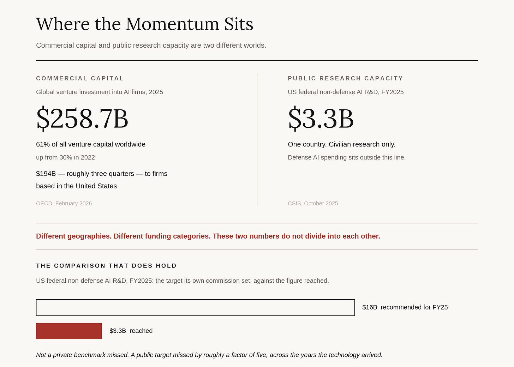
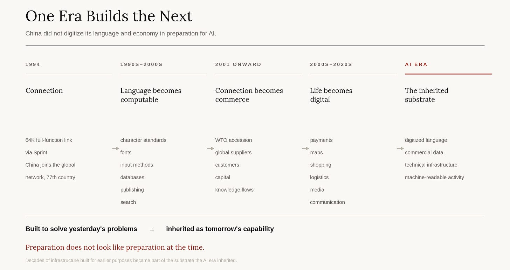
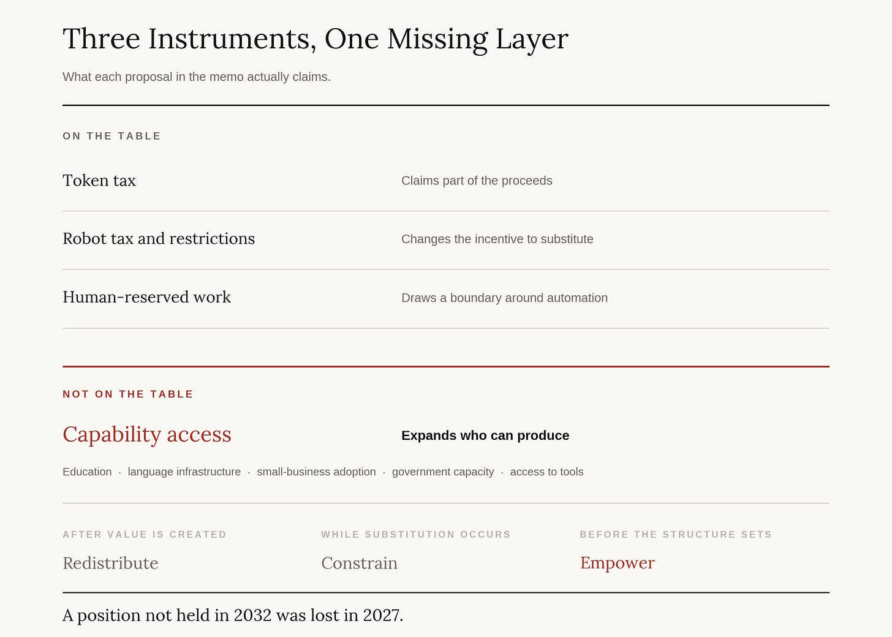

# Attention Is Not Preparation

> Bill Gates has one of the best seats in the room. On August 26 he reported that almost no one outside the industry is paying attention.

On August 26, Bill Gates published roughly six thousand words on artificial intelligence. It is the first of several he plans on the subject. In the accompanying interview he calls it a shrill paper, and says he had not expected to be the shrillest voice arguing that society is not paying attention.

The alarm itself is familiar. Entry-level white-collar work disappearing across customer support, software, and paralegal work. Criminal capability available to actors with no technical skill. Bioterrorism risk that he now rates roughly fifty times above the risk of a natural pandemic. Children forming attachments to systems built never to push back.

What is not familiar is where he locates the failure. Gates is not primarily reporting that the technology is dangerous. He is reporting that the circle engaged with it stops at the industry’s edge. His words: “I’m just stunned at the lack of concern and discussion outside of the industry.”

Read that as evidence rather than as rhetoric. It was written by a man who has sat with Trump, Xi, and Macron, who knows the founders of the largest laboratories personally, whose foundation runs frontier models in drug discovery, and who has held a position at the technology frontier for half a century. Access is the entire point. The observer with the most complete view of what is happening reports that the view is not shared.

That is the Awareness Asymmetry, stated from the far end of it.

**The asymmetry is about position**

The Uneven Present argued that AI is not one global conversation, that it runs at different temperatures in different places, and that the difference is not a knowledge gap. Publics farther from the frontier are sometimes better read on AI risk than publics closest to it. The asymmetry is about presence: whether AI is a present-tense fact in a society’s life, or a future tense arriving from elsewhere.

Gates is the maximum case of presence. Everyone he names is inside the loop with him: the laboratories, the industry, government at the highest level. His complaint is that the loop does not extend, and that inside the industry the incentive runs the wrong way, because firms raising trillions have agreed to say nice things.

He also supplies the size of the lag at his own end of it. In the last quarter of last year he was stunned by the progress in coding. It took him months to register that the same threshold was also a cyberattack threshold. By his own account, almost nothing followed the recognition.

If the lag runs that long inside the best seat available, what runs in a ministry in Jakarta or a clinic in Lagos is not a lag at all. It is a different present.

## *Why governments are behind, in his own terms

Gates supplies the mechanism, and it is not a moral failure.

Government used to be the cutting-edge buyer. It bought the jets. It bought the rockets. That purchasing position is what gave government its technical depth, and it is what is missing now. Government is not the leading-edge market for AI, and it is not the major funder of the research. Depth of knowledge follows position in the market. Government has lost the position.

The scale of the commercial side is not in dispute. OECD data put global venture investment into AI firms at $258.7 billion in 2025, sixty-one percent of all venture capital worldwide, with firms based in the United States taking roughly three quarters of it. CSIS puts United States federal non-defense AI research at roughly $3.3 billion in fiscal 2025.

Those two figures do not divide into each other. One is global private capital, the other is one country’s civilian research budget, and any ratio built from them is a rhetorical object rather than a measurement.

There is a comparison that does hold, and it is the government measured against itself. In 2021 the National Security Commission on Artificial Intelligence recommended that non-defense federal AI research reach sixteen billion dollars by fiscal 2025. The figure reached $3.3 billion. The United States did not miss a private benchmark. It missed the target its own commission set, by roughly a factor of five, across precisely the years in which the technology arrived.

That is what the numbers establish. The direction of today’s AI research is set by investor conviction rather than public deliberation, and conviction tracks the markets that hold the wealth.

That is the Diffusion Substrate. AI reaches a jurisdiction already shaped, its questions and priorities fixed elsewhere. Most of the world is not choosing how AI is built. It is choosing what to do with it after it arrives.

Gates arrives at that mechanism from inside the frontier. This publication arrived at it from outside. Two routes to the same mechanism is worth more than either route alone.

## The ancestor: what nobody in 1994 knew they were building

On April 20, 1994, a 64-kilobit line ran from China’s National Computing and Networking Facility through Sprint in the United States. It was China’s first full-function connection to the global internet, and it made China the seventy-seventh country to connect. China’s accession to the World Trade Organization followed on December 11, 2001.

In the 1990s I worked with Ziff-Davis in China. We published _PC Magazine_ and _PC Week_, and later launched ZDNet there. We were reporting on the personal computer as a consumer object at the precise moment a far larger network began wiring the country to everyone else.

China’s rise is not attributable to the internet. Deng Xiaoping’s reform and opening established the conditions, joined by foreign investment, manufacturing, infrastructure, urbanization, and eventual entry into the global trading system. But rate is not a detail. Opening made connection possible. Globalization made connection valuable. The internet made connection fast. Had the same policies arrived a technological generation earlier, the diffusion of capital, technique, and commercial relationship would have run slower, and slower compounds differently.

Something else happened underneath, and it is the part that matters here.

Making a computer work in Chinese was not a trivial engineering problem. Character sets, fonts, input methods, sorting, databases, typesetting, search: all of it had to be rebuilt for a writing system that early computing had not been designed around. That work looked like infrastructure for the computer age, and it was. It was also infrastructure for the AI age, built by people who had no idea that was what they were doing.

Across the following three decades, Chinese commercial and cultural life became machine-readable. Books, newspapers, maps, payments, logistics, entertainment, argument. A civilization did not merely connect to computers. It became legible to them.

The Uneven Present made the claim that the frontier now sits behind a data wall only two civilizations have cleared, and that a civilization’s worth of digitized language is the one input that cannot be bought, only built across decades. This is how one of the two cleared it. Not by plan. By thirty years of work aimed at something else.

Nobody in 1994 forecast correctly. Preparation is a matter of being in position when the returns arrive, which means the substrate for the next frontier is being laid now, by people who do not know that is what they are laying.

## The dichotomy is about distribution

Gates’s central sentence is that AI will be “the greatest equalizer ever invented, or the worst source of injustice.”

That sentence describes two distributions of one technology. Who holds the capability. Who is displaced by it. Who owns the resulting wealth. Who is protected from its risks. Who gets a say in what stays human.

Malice predates every tool. Fraud predates the network. Propaganda predates the platform. Weapons predate the model. What a general-purpose technology does is raise the ceiling on harm and the floor on defense at the same time, and the historical record on that trade is not ambiguous. We live longer, more children survive, and knowledge once held by a few hundred people is reachable by billions.

Gates’s own remedy runs on exactly this logic. He argues that any model capable of designing novel molecules should be monitored, that the monitoring must survive copying, and that the United States should propose the standard to China and ask what the objection is. That is capability answering capability. It is also a G2 proposition in unusually clean form. A rule against a cross-border frontier risk binds whoever adopts it, and settles nothing unless both full-stack ecosystems do.

He is blunt about what the two currently exchange. By his account the conversation with China runs: we will ban nothing, you will ban nothing, let us do that together. Mutual non-commitment, ratified. A coordination mechanism that coordinates on zero is the cheapest thing two governments can build, and it is what exists.

The optimism has a falsification condition, and it should be stated rather than assumed. The claim that defense keeps pace fails if offensive capability diffuses faster than defensive capacity can detect, patch, and respond. Gates supplies the live test himself. He expected loud voices as the frontier approached the point where a person with no technical skill could mount a cyberattack using AI. That point arrived. The voices did not.

That is a test of how capability distributes, not of what the technology can do. Which is his sentence again.

## Three instruments, three targets, one gap

Gates puts three instruments on the table. A tax on tokens, with something like half the revenue going to the state to fund a stronger safety net. A tax on robots, mixed with outright bans in some categories. And human-reserved work, in which a society agrees that certain jobs stay with people.

Two of those claim the proceeds. The third claims the boundary; it decides what AI is not permitted to do. None of them claims the means.

A transfer supports a displaced paralegal after the displacement. A reserved category constrains the displacement. Neither hands her the capability that caused it, and capability is the only one of the three that compounds against the concentration the other two were built to manage.

The fence is tested faster than it looks, and Gates says so. Asked how a country would hold a human-reserved category, he answers that it would have to change its import policy: tariff up goods produced without robots, on the model of the European carbon border adjustment mechanism. Read that slowly. A rule about what may not be automated inside one jurisdiction becomes a trade instrument at that jurisdiction’s border, or it becomes nothing. The moment a society decides childcare stays human, it has made a decision about customs classification. The instrument admits its own jurisdiction problem out loud, in the paragraph in which it is proposed.

There is a second reason the boundary is harder to hold than the arithmetic suggests. Gates thinks it is difficult to push automation above thirty or forty percent of the job market. At fifty percent, he says, a society could move to early retirement and a shorter week. At ten to fifteen percent, it is an utterly different society. The comfortable end of the range is the far end. The dangerous zone is the middle, where displacement is large enough to break the labor market and too small to force the settlement that would repair it. Policy aimed at the catastrophic case is aimed past the likely one.

## Redistribution is necessary. Capability distribution comes first.

Gates already has the better instrument in the memo, filed under convenience.

He describes a family overwhelmed by an application for student aid, health insurance, or food assistance, and an AI that streamlines it so they get help faster. The Foundation has spun off NextLadder for that exact case: what benefits exist, what training is available, I have been evicted, I am getting out of jail, I have to declare bankruptcy. Help for a person with no ability to hire advisors.

That is not a convenience. That is capability arriving in the hands of someone who could never have purchased it, doing work that used to require a professional on retainer. It is the strongest distribution move in the memo and it sits in the section about efficient government.

Put it at the center and the question changes. The question is not how the proceeds of AI are shared after they exist. It is how broadly the power to produce them is held before the structure sets.

That makes education policy an AI policy. Language infrastructure becomes an AI policy. Small-business adoption becomes an AI policy. Government’s own capacity to deploy becomes an AI policy. And it carries a deadline the tax question does not. A transfer legislated in 2032 works in 2032. A position not held in 2032 was lost in 2027.

## Where the public’s say is real

There is a slot in Gates’s own framework that only a public can fill, and he built it deliberately.

On human-reserved work, he declines to say which jobs. He says the answer runs country by country, and that he did not write the formula. He is right to decline, because it is not a technical question and no amount of access answers it. Whether childcare stays human, whether food preparation stays human, whether a teacher stays in the room alongside the tutor: these are questions about what a society refuses to hand over. There is no expert who settles them and no model that computes them.

He closes the memo by saying the questions are too consequential to leave to a small group of technologists, and that academia, business, government, and civil society all have a role. Note the shape of that list. It is a wider circle of institutions, which is a different thing from a public, and the difference is where the debt accrues.

Institutions will be built before the public understands the transition. There is no alternative and no fault in it. Legitimacy Debt arises at a specific point: when institutional speed outruns explanation, participation, and eventual ratification. Gates calls for new institutions before unemployment rises sharply, before communities are hurting, before public trust has eroded. He is right about the sequencing, and the sequencing is what creates the debt. The debt is payable later, in compliance that does not arrive.

Naming it is not an argument for building slower. It is an instruction about what has to be built alongside.

## The seat I have this time

I had the good fortune to spend part of my first professional life near the intersection of two historic changes: China’s opening, and the arrival of the computer and the network. I watched information technology compress the distance between China and everyone else. I watched industries form around capabilities that had not existed a few years earlier. I watched technologies that looked like sectors disappear into every sector.

Forty years later I have a seat near the beginning of another one. This time the seat is not in the press box.

I have spent the past month working inside Joienblanc, the private concierge company my son Winston and his co-founder Devon White are building. I said nothing publicly during that month on purpose. Turning a young company into an illustration for an argument I already hold is the fastest way to learn nothing from it.

The company is being built during this transition rather than retrofitted for it, which makes it a test rather than an example. Three things I currently believe are checkable from inside it. That organizational memory compounds instead of dispersing into inboxes and individual employees. That a small team coordinates a complex network without reconstructing the overhead of the last era. That abundant machine intelligence raises the quality of human service rather than lowering its price.

Each of those fails in a specific way, and the failures are the point. Memory that has to be maintained by hand is not memory. Overhead that moves from headcount to tooling has been relocated rather than removed. Service that gets cheaper and no better is the null result. I expect to report at least one of them.

## Gates is opening a series

He says this is the first memo, not the last, with a dedicated bio memo before the end of the year.

Code After should meet that work the way it should meet any new evidence. Awareness Asymmetry, the Diffusion Substrate, G2, Legitimacy Debt: these are propositions about what is happening, stated so they can fail. Evidence that strengthens them tells us something. Evidence that breaks them tells us more.

On the question that comes before optimism and pessimism, Gates and this publication say the same thing.

Attention is not the scarce thing. He has all of it he could want and reports it changed nothing.

The scarce thing is position, and it is being allocated now, by people who mostly do not know that is what they are doing. It was allocated that way in 1994 too.

Attention is not preparation.

---

_Sources: Bill Gates, “A turbulent AI era and critical choices to make,” Gates Notes, August 26, 2026. Mat Honan interview with Bill Gates, MIT Technology Review, August 26, 2026. Reporting in Fortune and Axios, August 26, 2026. OECD, “Venture capital investments in artificial intelligence through 2025,” February 2026. CSIS, “Federal R&D Funding Matters for U.S. AI Leadership,” October 2025, including the 2021 National Security_