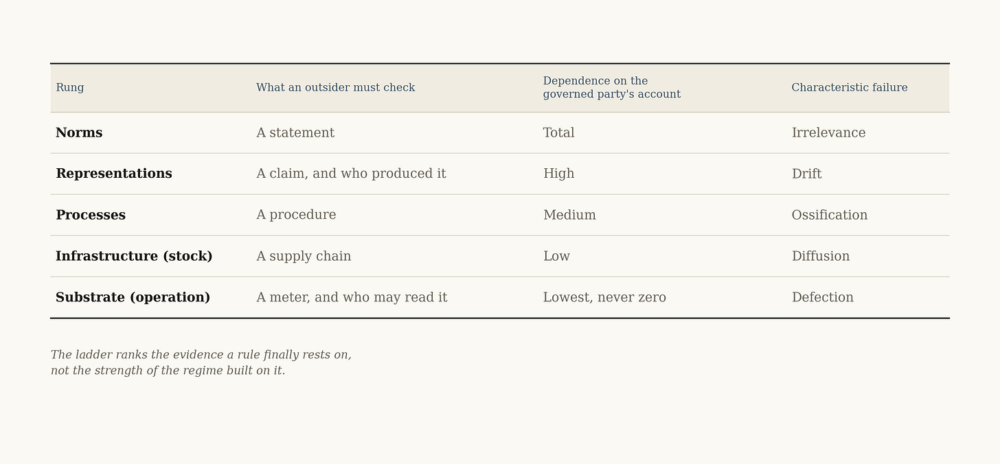
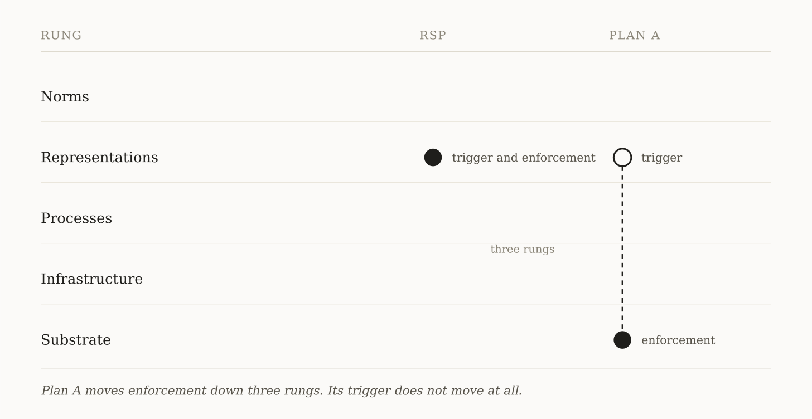

# Part I: The Enforcement Ladder 
>_Anthropic’s Responsible Scaling Policy and the AI Futures Project’s Plan A are not rival answers to one question. They bind to different objects, cost different amounts to build, and break in different places._

Two governance proposals arrived this year.

Anthropic has revised its Responsible Scaling Policy four times since the February rewrite. The AI Futures Project published _AI 2040: Plan A_, a recommendation rather than a forecast: a US–China agreement in 2029, total research transparency, managed scaling within the human range through 2035, a pause at top-human-expert capability, super intelligence deferred to 2040.

One exists and binds a single firm. The other would bind an industry and two rival states, years from now.  
  
The debate treats them as rival answers to one question: which is realistic? That question confuses scope with enforceability. A policy that binds one firm today and a regime that would bind two states in 2029 are not competing for the same job.  
  
The better question is structural. What must an outsider be able to see before a consequence can attach? Anthropic’s policy binds to evaluations and risk reports. Plan A binds to compute, data centers, and chip flows. They sit at different depths.  
  
This essay builds the instrument that measures the difference. It ranks proposals by their terminal enforcement object — the lowest thing on which compliance finally depends when a rule is tested. Part I builds the method and applies it to both documents. Part II follows the method into the near future: the erosion of the visible layer, and the machines after the language models. It ends at the scheduled September 24 White House visit, where President Trump has said artificial intelligence will be discussed.

## The principle, borrowed from the tax code
Earlier this year I began work on a narrow question. How does a state tax value it cannot measure?

AI poses it in the purest form. The accounting languages that govern the world economy were built to recognize transactions. Capability emerging from a training run is not a transaction. The ledger records the spend and misses the asset. Electricity, chips, salaries, depreciation all post cleanly. The thing they produced posts nowhere. Where capability appears at all, it appears as a construction: a number that is documented, defensible, and certified, without being an observation of anything.  
  
That work produced a principle. Taxation follows visibility.  
  
A fiscal claim survives in proportion to three properties of its base. Whether it can be measured without a valuation judgment. Whether it can be attributed to a place and a party by facts rather than by elections. Whether it leaves a trail someone other than the taxpayer can check.  
  
Wages acquired all three once employers were made reporting and withholding points. That is why labor income became the base the modern fiscal state was built on. Capability is weak on all three at the moment it is created. Its measurement is contested. Its attribution shifts between model, training run, firm, and jurisdiction. Its traces exist but have not been standardized into evidence an outsider can rely on. Which is why every attempt to tax capability at creation dissolves into definitional litigation, and why what survives are claims on what the state can already see: metered compute, registered equity, consumption events.  
  
The principle is not about taxation. Underneath it sits a fact about institutions.  
  
Institutions do not govern reality. They govern representations of reality. A state has no eyes. It perceives through filings, meters, invoices, audits, and categories — the observable state variables of the system it steers. Verification is how an institution perceives: the difference between a representation it must take on faith and one it can check against the world. A representation need not be true to be governable. That is precisely where the danger lives.  
  
Taxation is simply where the fact is easiest to observe, because revenue is countable and its absence is felt inside a fiscal year. The general form is shorter. **No regime holds a rule against what it cannot see.** Visibility does not guarantee enforcement. It permits it. An institution can rule on anything. It can only hold a rule against what an outsider can check.  
  
The principle has a lineage. A century ago Max Weber asked what made modern rational capitalism possible. His answer gave pride of place to two instruments. Capital accounting made an enterprise’s position continuously calculable. Calculable law made the consequences of action predictable enough to plan against. Accounting made positions legible; law made consequences legible. Together they converted economic conduct into forms institutions could act on.  
  
Weber’s word for the property was calculability, and it is the missing middle term. Visibility is the first condition: the institution can detect the object. Calculability stabilizes what it detects into categories and units that can be compared. Verification lets an outsider test the representation against the world. Governance begins when a consequence can attach to it.  
  
Others carried the point forward. James C. Scott showed how states make populations legible in order to administer them. Theodore Porter and Michael Power showed how numbers and audits became technologies of trust between strangers. That lineage is settled. What is new here is the sorting — ranking governance proposals by the object on which enforcement finally lands.  
  
AI enters exactly where the old coupling fails. Capability appears before accounting has a category for the asset. Machine-produced action enters institutions before law has settled who answers for it. AI did not create the principle. It is the cleanest demonstration the principle has had: a technology that concentrates enormous value and risk on the unrepresentable side of every institutional instrument at once.  
## The ladder
Every governance proposal binds to something. Most serious regimes touch several rungs at once. What the ladder identifies is the terminal enforcement object — the lowest thing on which compliance finally depends when the rule is tested.  
  
At the top sit norms: principles, pledges, voluntary codes. Below them sit representations: evaluation scores, safety attestations, risk classifications. In most current proposals these are produced by the party being governed. Below those sit processes: licensing regimes, audit requirements, conformity assessments — rules about how organizations must behave, verifiable in their paperwork if not always in their substance. Below those sits infrastructure, which is stock: chips, fabs, data centers, the export-controlled machinery of the supply chain. At the bottom sits the substrate, which is operation: power actually drawn, computation actually executed, workloads actually running on identifiable machines.  
  
That last distinction is not pedantic. Knowing that an actor holds the chips is not knowing what the chips are doing. Every serious verification regime eventually discovers the difference.  
  
The rungs are distinguished by what an outsider must check to establish compliance: a statement, a claim, a procedure, a supply chain, an operational trace. This is a ladder of evidentiary depth, not a dependency stack. Each descent reduces the rule’s reliance on the governed party’s own account of itself.  
  
One thing the ladder never does is reach the ground. A meter is also a representation. It can be misconfigured, selectively installed, spoofed, or unplugged. The ladder does not descend from representation into unmediated reality. Institutions never arrive there. It descends toward traces an outsider can reproduce with steadily less dependence on the governed party’s own account. That is the whole of the difference, and it is enough.

The ladder compares objects, not actors. A firm binds itself in a day; two rival states take a decade. That difference belongs to the actor question, which the method asks separately. Hold the actor and the scope fixed, and the ladder still sorts. The claim is falsified by a rule that binds low, costs little to adopt, and holds under pressure. I have not found one.  
  
Placement is not a judgment of seriousness. It is a prediction of behavior under pressure. The higher a rule sits, the cheaper it is to adopt and the less it holds when the incentives against it grow large. The lower it sits, the more it costs to establish — politically, diplomatically, industrially — and the more it holds once established, because compliance is observable by parties with no stake in the answer.  
  
State the trade plainly, because it governs everything below. Enforcement stability is purchased with adoption cost, and the price rises as governance descends the ladder.  
  
The trade also predicts time-to-binding. A pledge is a press release; it binds on the day it is issued and until something is at stake. Firm-level policies bind on publication, because a firm can bind itself. Process regimes take years between proposal and force: the EU proposed its AI Act in 2021 and is still bringing obligations into effect in stages five years later. Infrastructure controls arrive when a state holding a chokepoint decides to use it, and hold only while the chokepoint does. Substrate treaties have not arrived at all. What they cost is not the meter. It is the standing that lets a rival read it, and nobody has manufactured that.  
  
Governance at the top of the ladder is current and cheap, and it binds until something is at stake. Governance at the bottom arrives late and binds after. Underneath, governance disputes are disagreements about which rung can still carry weight.  
  
One warning belongs here, and Weber supplies it. He watched the machinery of calculability conquer the modern world and named its danger. Instruments built to make conduct predictable also make control impersonal and scalable, and they keep running after the purposes that justified them fade. Descending the ladder buys enforceability. It does not buy wisdom. A meter can establish that a threshold was crossed. It cannot decide whether the threshold is just. The ladder ranks what can hold. Politics must still decide what should.

## Three questions instead of one

The ladder yields a method. Take any AI governance proposal and ask three questions.

**What does it bind to?**  
Which rung, and can an outsider observe that object without depending on the governed party’s account?

**Who is the actor?**  
A firm, a consortium, a legislature, a pair of states?

**What is its characteristic failure?**  
Every rung fails differently. Seriousness is measured by whether the proposal has built anything against its own.

Norms fail by irrelevance. Representations fail by drift. Processes fail by ossification: the paperwork survives, the substance departs. Infrastructure controls fail by diffusion, as the controlled capability is re-created outside the perimeter. Substrate regimes fail by defection — the state that cheats.

Every rung can fail in more than one way. What the table names is the failure each is most exposed to. The question to put to any proposal is not whether it can fail. Everything on the ladder can. The question is whether its architecture anticipates its own characteristic failure or merely hopes around it.  
  
Now apply the method.

## Case one: the Responsible Scaling Policy##
**Object: representations, with a process layer under active construction.** The RSP has always depended on capability evaluations. If the model demonstrates capability X, safeguards Y must precede further scaling. Those evaluations are designed, run, and interpreted by the lab itself.

**Actor: a firm, hoping for diffusion.** The explicit theory was a race to the top, and it partly worked. Rival labs adopted broadly similar frameworks, and the approach informed early legislation.

**Failure modes: non-adoption first, drift second.** The first cannot be answered from inside the firm’s own rung. The second can be described precisely enough to check.

The drift mechanism deserves precision. Stated carelessly it becomes an accusation. Stated precisely it becomes a mechanism anyone can check.  
  
Self-produced representations do not automatically decay. Audited financial reporting mostly holds. It holds because a Translation Layer stands behind it — the assurance profession, with its standards, its liability, and its licenses to lose, converting a firm’s self-description into a representation an outsider can act on. Accounting and law became load-bearing not because their representations were naturally true, but because standards, professions, adjudication, and liability made misstatement costly and reliance safe for strangers.  

That is what a Translation Layer is: the institutional machinery that turns reality into governable representations. Behind every representation that holds under pressure stands some form of one.  
  
So state the mechanism rather than a law. A party that defines the standard, produces the evidence, and judges what the evidence requires will drift toward what it can defend. Where a Translation Layer stands between the party and the reader, something checks the drift. Where none stands, nothing does.  
 
The strongest evidence for the premise comes from the lab itself. Anthropic’s February rewrite reports that its pre-set capability thresholds proved far more ambiguous than anticipated. It states that the science of model evaluation is not developed enough to give dispositive answers, and that some mitigations required at higher capability levels may prove impossible to implement without collective action. Read through the ladder, that is a firm discovering the limits of the representation rung in real time.  

What it did next is the part worth watching, because the revisions run in both directions at once. 

Some built the representation outward. The Long-Term Benefit Trust can now request external review of a risk report and approve who conducts it. Review can be divided among several outside reviewers, so long as every unredacted section is seen by at least one. Public reports must mark where material was cut.  
 
Others pulled it inward, and the changelog is explicit about each. The February rewrite changed the kind of commitment being made: version 2.2 required the company to pause development and deployment where required safeguards could not be met, subject to an existing exception for competitor-driven risk; version 3 reframed some of those safeguards as recommendations to the industry rather than requirements on itself. The same rewrite lengthened the comprehensive assessment cadence from three months to six. May and July each revised a capability threshold to better track the threat model of concern — two threshold revisions in six weeks. July narrowed internal circulation of unredacted risk reports from all regular-clearance staff to a floor of two hundred employees. July also permitted a risk report to describe risk as of a coverage date rather than as of the date of publication.  
 
Read that last one twice. A published account of current risk need no longer describe the present at the moment it is published.  
 
Every one of these changes is defensible on its own terms, and Anthropic gives the terms. Rushed analysis produces bad evaluations. Thresholds written before the science matured need correcting. None of it is hypocrisy, and none of it requires alleging motive. It is what a representation regime does when the governed party defines the standard, produces the evidence, and judges what the evidence requires. Where the incentive to expand disclosure is strong the policy expands it. Where the incentive runs the other way the policy follows that too. Five versions in four and a half months, and it is still the fastest-moving thing on the ladder.  
 
Revision is not evidence of bad faith. It is evidence that the governing object is still a contestable representation rather than a settled fact.  

Which is why the right word for the RSP is scaffolding. Scaffolding is not the building. What AI governance has at its center is not a missing auditor. It is a missing profession: no licensure, no duty running to third parties who rely on the finding, no liability for a negligent evaluation, no adversarial access as of right, no adjudicative venue where a contested finding can be tried. Financial assurance has all five, the first three from the profession and the last two from the legal system it sits inside, and it acquired them over a century, mostly after failures.  
 
Until the equivalents exist, the reviewer’s independence rests on the reviewed party’s continuing consent. The representation rung holds exactly as long as the incentives permit. The trade prices that honestly: cheap to adopt, weak under pressure.  
 
None of this makes the RSP unserious. A voluntary policy cannot bind an industry once the incentive to leave it grows large enough, and the RSP concedes that limit in its own language, separating what one firm can do alone from what requires the industry and governments together.  
 
Nothing can be built against non-adoption at the firm’s own rung. A competitor that never signs is simply outside. Pressure from procurement, insurers, courts, and investors can raise the price of staying outside, but every one of those levers sits on a lower rung and belongs to someone else.  
 
The policy’s demonstrated function is to keep the machinery alive: the evaluation methods, the norms, the trained evaluators, the public evidentiary record. Everything the missing profession will need on the day it is chartered, maintained in the years before any real regime exists. Judged as an industry-wide line, the RSP cannot hold it. Judged as scaffolding, it is doing the only job available at its rung.

## Case two: Plan A
**Object: the substrate.** Plan A’s enforcement architecture centers on compute and its physical infrastructure: declared training runs, monitored data centers, and verified chip flows. Its proposed inference-only verification would let existing models keep serving the public while new frontier training stopped. Around the substrate it wraps total research transparency for AI R&D.

**Actor: states.** The United States and China as the anchor pair, with multiple companies across multiple countries scaling together inside the regime.

**Failure mode: defection.** Which is what makes Plan A the most institutionally serious document the safety community has produced. It is designed around its own failure mode. The verification regimes, the transparency requirements, the mutual monitoring of compute all exist because the authors assumed cheating and built for it.

That is the difference the ladder predicts: architecture designed around its characteristic failure, against architecture still building toward one.

But the comparison requires a correction, and it cuts against the neat version of the story. Plan A’s enforcement mechanism is substrate-facing. Its trigger is not.  
  
“Top-human-expert capability” is a representation. It is a conclusion produced by evaluations, benchmarks, contested categories of expertise, and institutional judgment about what counts as expert and in which domain. A meter can establish that a declared training run exceeded a compute ceiling. It cannot determine what the human frontier is, whether the evaluation measures the capability that matters, or whether a model has crossed the line in a domain no benchmark covers.  
  
So Plan A does not escape the representation problem. It divides it. Enforcement moves down the ladder, where it can be observed by parties with no stake in the answer. Boundary-setting stays up the ladder, in a world of evidence, judgment, and contest. The treaty regime therefore needs the same missing profession the firm-level policy needs, and needs it binationally.

That is not a flaw in the plan. It is the condition every serious regime meets, and it generalizes the mechanism past the case that produced it. Descending the ladder relocates the representation problem. It never dissolves it.  
 
One distinction keeps the analysis honest, and it is a distinction, not a doubt. The framework evaluates enforceability, not achievability, and neither is a judgment of desirability.  
 
It predicts that Plan A’s regime would hold if implemented on two conditions, and they are separate conditions. Coverage: whether every relevant actor and site falls inside the perimeter. Verification integrity: whether what the perimeter reports can be trusted. A substrate regime with holes in it is not a regime but a map of where to build. A meter that can be spoofed is not evidence. A regime can satisfy either condition while failing the other, and both fail before any state has decided to cheat. That is what binding to the substrate buys, and it is worth every point of the adoption cost.  
 
It predicts nothing about whether two rivals will pay that cost. That is a question about politics, not architecture. It predicts nothing about whether the thresholds a regime enforces are the right ones. The framework sorts proposals. It does not elect governments.  

Plan A’s hardest wager is not architectural. It is temporal.  
 
The plan’s own timeline runs from a 2029 agreement through managed scaling to 2035, a pause at the human frontier, and an unpause in 2040. That asks the substrate to remain verifiable for eleven years after the deal, and to remain concentrated enough to make the deal possible in the first place. The architecture assumes verification capacity will decay more slowly than capability diffuses.  
 
The substrate does not erode. It grows. What erodes is the concentration and the legibility that make substrate governance possible at all. Whether that erosion outruns the plan’s timetable is the wager, and Part II is where the evidence for it belongs.

## What the ladder settles
The ladder does not say which proposal to choose. It says what each can hold, what it must borrow from other rungs, and where it will break first.  
  
Anthropic is building representational machinery from the top down. Plan A would build enforcement from the substrate up. Both arrive at the same missing institution: a trusted way to turn contested capability into consequences that neither firms nor states can redefine on their own.  
  
The next question is whether that institution can be built before the visibility it depends on disappears.  
  
Part II turns to the machines after the language models, and to why they shorten the window and improve the odds at the same time.  
  
Next Monday.