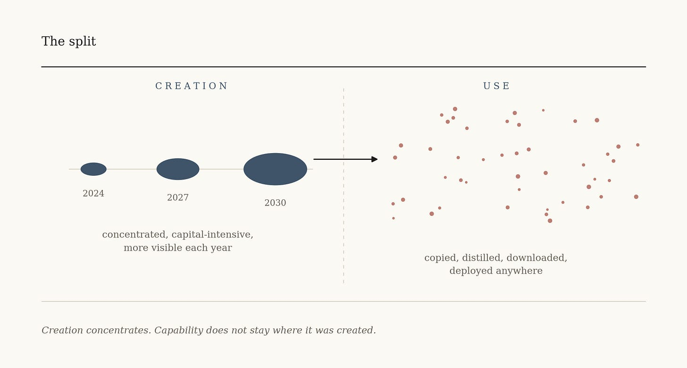
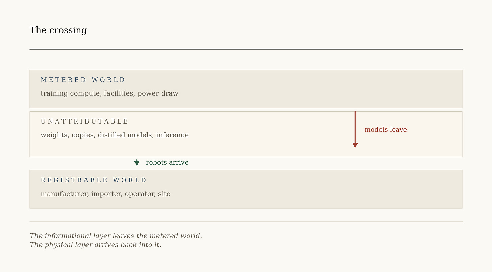
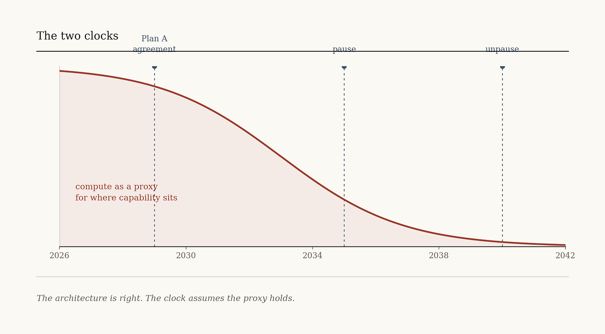

# Part II: The Window

>_Part I ranked governance proposals by the object they bind to. This one asks how long that object stays adequate._

Part I built a method. Every governance proposal finally rests on something an outsider has to check: a statement, a claim, a procedure, a supply chain, a measured physical event. Rank proposals by that object and they sort. Anthropic’s Responsible Scaling Policy is scaffolding at the representation rung. Plan A has the stronger architecture and the harder clock.

This part asks the temporal question. How long does physical compute stay a good proxy for where consequential capability sits?

The answer is not that the substrate is disappearing. It is getting larger. Frontier training runs need more chips, more power, more capital, and more land every year. The biggest clusters will be more visible at the end of this decade than they are now, not less.

The substrate is not eroding. It is separating from what it produces.

## The split

Compute is an attractive thing to govern because it is physical, countable, expensive, and made by a handful of firms. Those properties remain strongest at the frontier.

But visibility at creation is not visibility for the life of the capability.

Once a model is trained the weights can be copied. A smaller model can be distilled from it. Inference moves to other clouds, private data centers, laptops, vehicles, factory floors. A capability produced inside one declared facility turns up in ten thousand places that facility does not control and cannot see.

Yesterday’s frontier becomes tomorrow’s ordinary tool. That is the entire mechanism, and it does not require anything to erode.

So the governance problem does not descend one ladder in a clean sequence. It divides in two.

Upstream, states can still govern creation: chips, facilities, declared runs, operational verification. Downstream, they have to govern use: access, permissions, actions, consequences.

Upstream asks where the capability was made. Downstream asks where it is running, what it can reach, and who answers for what it does.

Different questions. Different evidence. Different institutions.

The upstream tools are being built now. The downstream ones already exist, scattered across product safety, sector regulation, liability, insurance, contract law, and professional responsibility. The problem is not that nothing is there. It is that nothing joins those pieces into a continuous chain running from the training run to the consequential act.

**Energy does not explain itself**

Follow the upstream half far enough and governance arrives at energy, because a facility at frontier scale cannot hide its power draw from the grid operator. That much is true and it is worth less than it first appears.

A meter shows that electricity was consumed. It does not show which model ran, whether the work was training or inference, what data went in, or what came out. A steel mill, a hospital campus, a crypto operation, and a training cluster all draw power.

Energy is evidence. It is not a verdict.

Which is the general form of the problem rather than an exception to it. Every rung on the ladder needs something above it that turns a physical trace into a claim an institution can act on. The meter reading is not the rule. The rule is what the two parties agreed the reading means, who may inspect it, and what follows when the accounts differ.

AI has technical experts and private auditors. It has no recognized body with authority to define what a compute declaration contains, set the standard for assurance, inspect the evidence, and issue a finding that firms and states can rely on.

Part I called this the missing profession. Here the same absence appears one rung lower.

## When trust falls

There is a second force moving governance toward physical evidence, and it has nothing to do with technology.

When institutions stop believing a representation, they demand evidence closer to the underlying event.

That is what a financial panic is. The market stops accepting a disputed mark on the collateral and moves toward cash and central bank reserves — not because those need no representation, but because they are the least contested settlement claims in the system. Part I made the point that the ladder never reaches unmediated reality. The panic does not reach it either. It runs toward whatever is currently least in dispute.

The pattern has run slowly before. As enterprise became continuous and capital-intensive, capital accounting made a firm’s shifting position calculable. As securities markets outgrew voluntary disclosure, mandated reporting and independent audit turned private accounts into representations that strangers and states could act on. Each time complexity outran the representation, institutions either built a better one or fell back to what they could hold.

AI creates both pressures at once, and they run against each other.

Technology is separating capability from the physical origin institutions can observe. Falling trust is making institutions demand evidence closer to physical events.

One movement weakens the proxy. The other increases the weight placed on it. Nobody is coordinating them, and that is the race.

## What open weights change

Open weights sit at the center of the split and cut both ways.

They weaken containment. Once capable weights are downloadable, the infrastructure that trained the model stops being the only infrastructure that matters. The capability crosses borders without the chips, the facility, or the developer going anywhere.

They also reduce dependence on any single model owner. Broader access, outside testing, no requirement to accept one provider’s price or product rules.

What they do not do is disperse power. They move it. Weakening the model layer pushes value toward the layers that remain concentrated: chips, cloud, distribution, proprietary data, and the platforms that sit between the model and the user. Microsoft’s strategy makes the point in public. It is building products so the model can be swapped without the product changing, which is a bet that model openness and platform concentration coexist comfortably.

Both governments have now noticed. Washington is weighing tighter restrictions on Chinese open-weight models and their developers. Beijing is weighing limits on overseas access to its most capable ones. Neither is settled. Two states arriving at the same instinct from opposite positions is usually a sign that something has become load-bearing.

The open-weight question is not a side argument about business models. It sets the rate at which capability separates from its place of creation, and it decides where control accumulates afterward.

## After the language models

A framework proposed now will govern machines that do not exist yet. The objection writes itself. How do you regulate what nobody can anticipate?

The objection has the ladder upside down.

Systems are increasingly trained on video, sensor data, simulated environments, and action traces rather than on text alone. Physical AI is arriving in vehicles, warehouses, factories. China is attempting humanoid manufacture at a scale few other countries are publicly contemplating, with the same capacity logic it used on batteries and vehicles.

Rules written tightly around today’s architectures will age fast. Capability categories, risk taxonomies, benchmark suites — all of it becomes incomplete the moment a system arrives that nobody categorized. Rules attached to physical inputs survive architecture changes better, because every system that computes needs hardware, energy, and somewhere to be.

Durability is not sufficiency. Those traces show where a capability was made more readily than what it can do or where it went.

And here the framework makes its least intuitive prediction, so it should be stated at full strength.

Embodiment does not make AI easier to control. It makes it easier to attribute.

A downloaded model running on local hardware may leave no trace an outside institution can reach. A deployed industrial robot has a manufacturer, an importer, an operator, a site, a maintenance record, and an insurance relationship. It came through customs. Somebody owns it. Somebody put it there.

That does not make its behavior easy to control. The software updates remotely. The model comes from a third party. The action emerges from hardware, instructions, and local conditions interacting. Small devices, imported components, and fragmented ownership will create blind spots that do not exist today.

But attribution and control are different problems, and only one of them has an institutional vocabulary already built. Product safety, workplace regulation, registration, inspection, insurance, and liability have handled objects that occupy space for a century. That vocabulary will need rewriting. It does not need inventing.

Physical AI returns part of artificial intelligence to the registrable world.

## The window

So the window is not the period before AI becomes ungovernable.

The window is the period in which creation remains concentrated enough to observe, while the institutions needed to govern distributed use have not yet been joined into anything continuous.

Both halves are moving. Creation stays visible and accounts for less each year. Use grows, and the institutions covering it stay fragmented.

Which means compute governance will not fail by becoming impossible. It will fail by becoming incomplete while everyone still believes it is working. A regime built entirely around frontier training will keep producing accurate reports about a shrinking share of what matters. The reports will be true. They will also be beside the point.

Plan A’s 2029 agreement date sits inside the window, which is to its credit.

And Plan A is not a compute-monitoring proposal in the narrow sense. It already knows that trained capability moves. It proposes controlled transfer of model weights, separate research and inference environments, auditors inside secure boundaries, and verification intended to establish that a designated system is performing inference rather than new training. Its authors have written down which of those assumptions they consider optimistic.

That is to their credit and it sharpens the question rather than answering it.

The architecture depends on a perimeter holding for eleven years after the agreement. Every relevant site inside it. Weight transfers staying in controlled channels. Derivative models and covert projects not accumulating into a second system outside the one being measured. Inference verification remaining technically reliable as architectures change. Third-country compute not becoming the place where the assumptions go to fail.

So the question is not whether operational compute stays visible through 2040. It may. The question is whether a verifiable chain can be held from the creation of a capability through its custody, movement, modification, and use.

The substrate does not vanish. It stops being sufficient on its own.

## September

Which brings this to a table that now exists.

Reuters reported in July that the United States and China will hold AI talks in September, led on the American side by the Treasury Secretary, and likely to take place before President Xi’s scheduled September 24 visit to Washington. The talks came out of the May summit. Dates, agenda, and location are still being decided.

Reporting suggests the first meeting produces no agreement and instead tries to settle basic terms, starting with what counts as a frontier AI model.

That is the correct place to start, and it is worth saying plainly why, because it will look like a disappointment to anyone expecting more.

Durable regimes have relied on some combination of shared definitions, data exchanges, notifications, agreed counting rules, and procedures for testing a declaration. Those mechanisms usually grew alongside the limits rather than before them. The limits still depended on them. The Montreal Protocol put production and consumption reporting at its center. The Biological Weapons Convention never acquired a verification mechanism and has spent fifty years unable to resolve a compliance dispute.

The analogy is not identity. Models are not warheads, chemicals, or pathogens. The recurring institutional problem is simpler than any of those cases.

A limit cannot hold when the parties have no agreed way to determine what counts, where it is, and whether a declaration is true.

So the useful asks for September are unglamorous and none of them forecloses anything.

Agree what a frontier training facility is. Agree what a compute declaration contains. Test whether declared workloads can be told apart from prohibited ones. Establish what energy data can and cannot show. Build protections for commercial and security-sensitive information. Decide what happens when two measurements disagree. Name counterparts who will still be there in a year.

Nobody slows down at that table. They agree on meters.

Measurement is not free. It exposes information, creates surveillance risk, and hands each side something it can use. Any reciprocal system has to govern the watcher as carefully as the watched. That is an argument for designing verification now, while both sides still need each other’s cooperation to get it, rather than after.

And one thing rides on it that is closer to home than the summit. Without evidence someone outside can check, claims about safety and benefit remain assertions made by parties with a stake in the answer. That is a weak foundation for a technology this consequential, and it will hold only until the first accident that nobody can independently explain.

Counting rules are not a brake on AI’s future. They are part of its license to have one.

## What would prove this wrong

The claims here are stated so they can fail.

If fixed compute thresholds remain a sufficiently complete proxy for dangerous capability despite efficiency gains, distillation, open weights, and distributed inference, the split described here is wrong.

If open weights consistently disperse control rather than moving it toward chips, clouds, and platforms, the account of where power goes is wrong.

If embodied systems prove no easier to locate, register, insure, and attach liability to than downloadable models, the embodiment prediction is wrong.

If shared definitions and verification practice can be negotiated in the 2030s on the same terms and at the same cost as now, the window claim is wrong, and happily so.

And if a representation-anchored regime survives a real competitive crunch with nothing independent standing behind it, Part I was wrong about drift.

The principle underneath does not depend on any of them.

Institutions do not govern reality. They govern representations of it. When the representations stop being reliable, institutions either repair them or fall back to what they can still check. Economic life became governable through the ledger and the legal code. AI is adding chips, facilities, operational records, and energy readings to that language, because the inherited ones no longer see enough.

The proposals crowding this debate — scaling policies, AI acts, export controls, verification plans — are competing bets about which evidence stays usable and for how long.

Sort them that way and the order is not hard to see. Keep the bridges standing. Charter the missing profession. Build the counting rules while creation is still concentrated. Join the deployment institutions into something continuous before the capability arrives that will not stay where it was made.

Taxation follows visibility. Governance does too.

The meter is running.

---

_The working paper developing this framework — “Taxation Follows Visibility: The Fiscal Epistemics of the Artificial Intelligence Economy” — is forthcoming on Zenodo in October, with full citations including the Weber sources. Plan A is at ai-2040.com. Anthropic’s Responsible Scaling Policy is at anthropic.com._