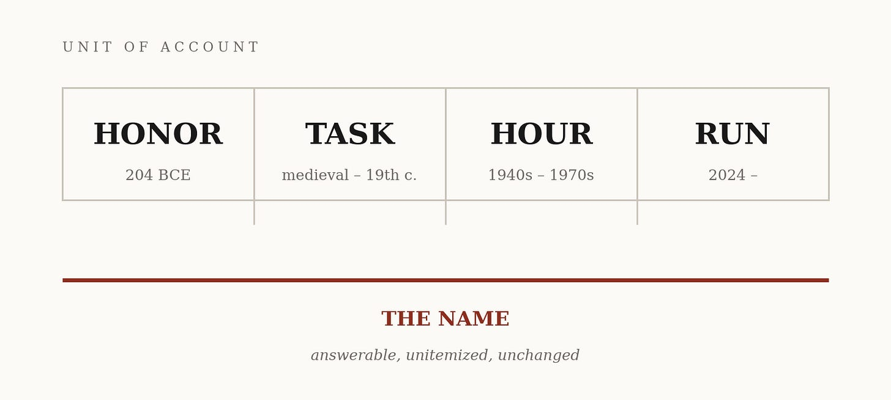
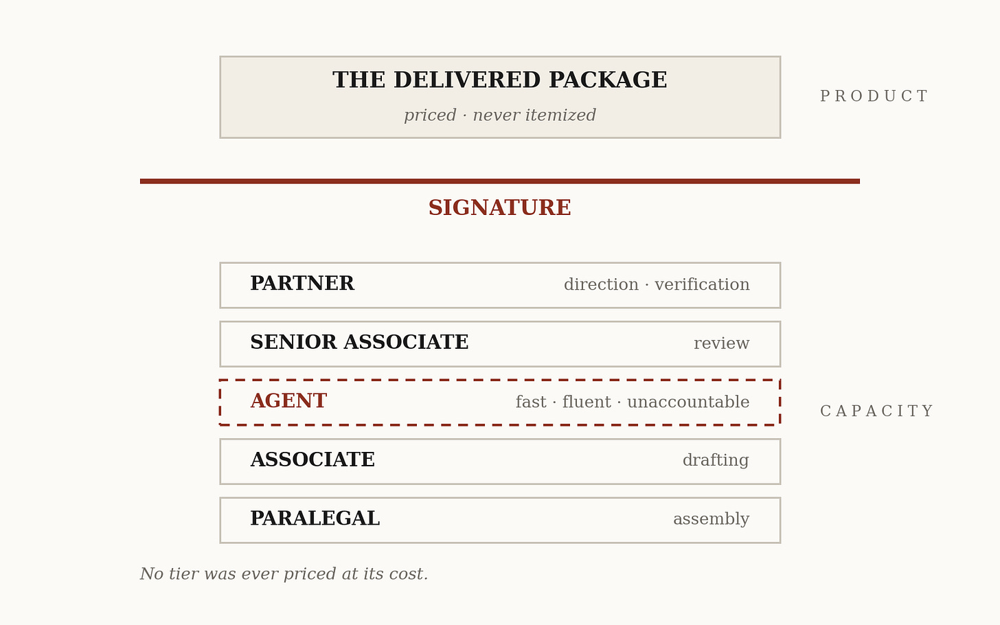
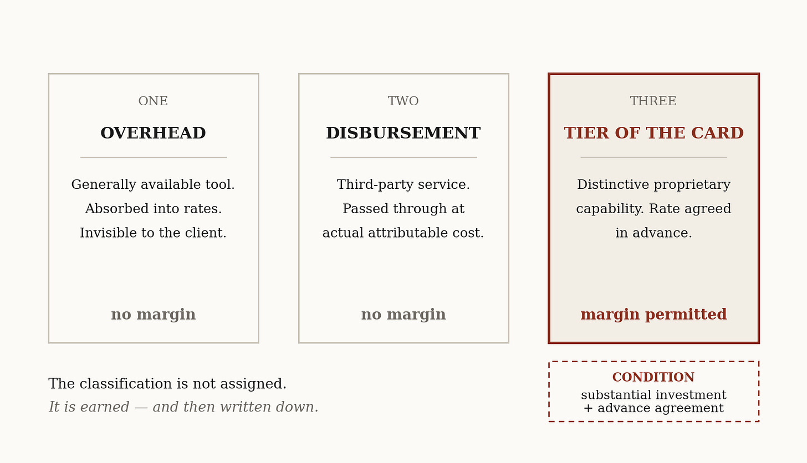
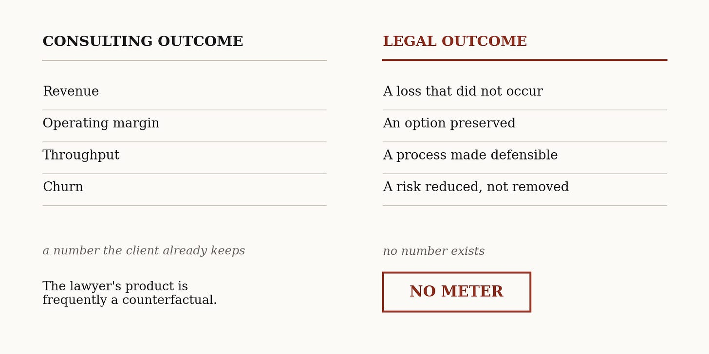
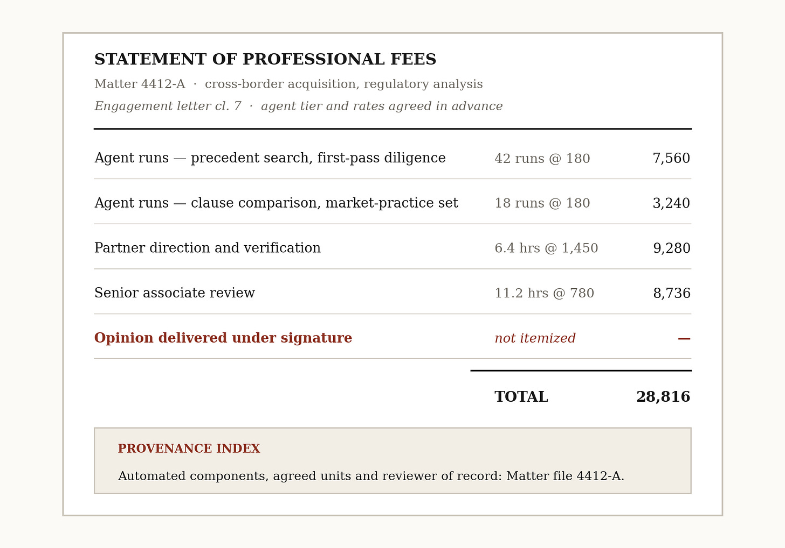

# The Stamp and the Meter
> The billable hour was never a measurement. It was a grammar, and the machine is only changing its units.

AI was supposed to kill the billable hour. The argument writes itself. When a research memo that took thirty associate hours takes ninety minutes of machine time, billing by the hour becomes either absurd or dishonest. Absurd if the firm bills ninety minutes for work it once sold for thirty hours. Dishonest if it bills thirty hours anyway. So the hour must die, and firms must flee to flat fees, subscriptions, outcomes.

The consulting profession has already begun. In a June 2026 letter to the Financial Times, McKinsey senior partner Shelley Stewart III wrote that more than 30 percent of the firm’s fees are now tied directly to client outcomes, a share that has been growing for years. That is not a data point. It is a trend line—and the best available test of the argument being made here.

But the conclusion drawn from it rests on a misdiagnosis.

The hour measured time. The rate priced the name behind it. **The hour was the meter. It was never the product.**

The profession has had the evidence in front of it for thirty years. Fixed fees, capped fees, blended rates and success fees have all been legally available and commercially offered since the 1990s. Clients asked for them. Consultants recommended them. The hour survived. A convention that outlives three decades of better alternatives is not being held in place by inertia. It is doing something the alternatives do not do.

## A young convention

Start with how lawyers have actually been paid, because the history is shorter and stranger than the profession remembers.

The Lex Cincia of 204 BCE barred advocates from taking payment for pleading. What an advocate received instead was an honorarium: a gift offered afterward, sized to gratitude and standing rather than to labor. The prohibition proved unenforceable and Rome gave way. Notice how it gave way. Under Claudius the law set a ceiling on what an advocate could receive, not a rate at which he could charge. Even in retreat it declined to supply a unit. The logic was exact. Advocacy was the exercise of a name, and a name can be honored but not metered.

England carried the same idea further than anyone finds comfortable to recall. A barrister’s fee was an honorarium rather than a contractual debt, which meant he could not sue a client for it. That rule survived until section 61 of the Courts and Legal Services Act 1990.

And here is the fact the tidy version of this history hides. While barristers took honoraria, solicitors billed by the item. Per letter written, per appearance entered, per page engrossed. Two units ran side by side, in the same profession, for centuries. The unit was never a stage the profession passed through. It was whatever each branch of the work made countable.

The hour came last, and came from management rather than from law. Reginald Heber Smith built systematic time records into law office administration at Hale and Dorr from 1919, dividing the day into six-minute units, as an internal tool for running a firm rather than a way of charging clients. Hourly billing spread outward through the 1950s and 1960s. In 1975 the Supreme Court held in _Goldfarb v. Virginia State Bar_ that an enforced minimum fee schedule violated the antitrust laws, removing the principal support of scheduled pricing. The billable hour conquered the profession in roughly the same years the photocopier did.

It is not an ancient institution under technological siege. It is a twentieth-century convention, younger than the partnership structures it bills through, a parenthesis inside a much longer story.

Honor, task, hour. Three units, one product. In every case the client bought graded intelligence under a name that answered for it, and the unit of account was whatever the era could count. The units changed. The grammar did not.

## What the card priced

The rate card confesses this in its own mechanics.

A partner’s hour costs the client several multiples of a first-year’s hour, though both contain sixty minutes. Associate time has always been sold well above its employment cost, and the spread funds training, review, premises and the partnership. That is leverage, the quiet engine of the model. Hours are then blended when the matter demands it, written down when the client objects, written off when the training ran long.

That is not how anyone treats a measurement. It is how a profession uses a countable unit to distribute the price of something else across a production hierarchy.

And notice what never appeared on the card. No invoice in the profession’s history has carried an entry reading _judgment: two hours_. The associate’s draft contains judgment-shaped choices. The senior’s markup contains more. But judgment becomes _nameable_ at exactly one point, which is where a lawyer advises, signs, files and answers. Everything below that point is capacity. The point itself is the product.

Capacity below, name above. That is the architecture the rate card has financed under every unit it has used.

## The new grade

The agent arrives looking, to the rate card, oddly familiar. A new grade of supervised intelligence: fast, tireless, fluent and unaccountable. It cannot hold a license, owe a professional duty, or be sanctioned as counsel. It produces work without becoming answerable for it.

The reflex is to price it at machine cost, a commodity line somewhere above the photocopying. The reflex is wrong for the same reason the first-year was never billed at salary. No tier of the card was ever priced at its cost. Each was priced for what the firm had built into it.

An agent tier can follow the same rule. But only if the building happened.

A firm’s agent is not the general counsel’s subscription if the firm has made it something else: the firm’s codebook encoded, which precedents weigh and what clauses mean in this market’s practice and what this client’s board will not accept, running inside workflows the firm designed, against verification the firm maintains, corrected by the firm’s own lawyers. Where that is true, the client can rent the same base model tomorrow and still not rent the firm’s capability. Where it is not true, the client can rent nearly everything the firm has.

That is a fork, not a promise, and it settles the margin question.

The fear is that transparent agent pricing collapses the leverage pyramid, replacing profitable middle tiers with a cheap software line. But leverage was never sacred about its substrate. For seventy years it ran on salary arbitrage: hire capacity at one price, sell it at another. It can run on engineering arbitrage instead: build a capability once, govern it, deploy it across matters, price what was built. The middle of the pyramid does not vanish. It changes material.

Margin compression is real, and it falls on firms that rent rather than firms that build. The machine does not destroy leverage. It separates earned leverage from rented leverage. The hour does not die. The unearned version of it does.

## The classification fight

The agent must now be entered somewhere, and the books offer three doors.

Door one is overhead, like the office lights. Absorbed into rates, invisible to the client. Door two is a matter expense, like the research database. Passed through on disclosed terms at attributable cost. Door three is a tier of the card, a defined capability supplied at a rate agreed with the client.

The question is empirical before it is doctrinal. Is this a commodity utility, or a capability carrying the firm’s methods, verification and accountable judgment? The answer differs by firm, which means the classification is not assigned. It is earned.

The ethics rules do not settle the fight. They set its terms, and the terms are more specific than the profession has noticed.

The American Bar Association’s Formal Opinion 512, issued in July 2024, holds that a lawyer billing hourly may charge only for time actually spent using and reviewing the tool, never for hours the machine saved. Fees and expenses must be reasonable. A generally available tool that works like ordinary office equipment belongs in overhead. A third-party service is passed through at attributable cost unless the client has agreed to another reasonable basis.

Then comes the passage that matters. Where a firm has made a substantial investment in a relatively distinctive proprietary tool, the opinion contemplates firm and client agreeing in advance on specific charges for its use.

The opinion does not create door three. It describes the conditions under which door three survives a challenge, and the conditions are exacting. Building is not sufficient. Building and agreeing is.

The moat comes from the investment. The right to charge for it comes from the engagement letter. A firm that builds a genuinely distinctive capability and never writes it into its terms has bought a moat and forfeited the margin.

The opinion binds nobody by itself. State bars adopt, adapt or ignore, and reasonableness decides each matter. But the direction is unambiguous. The rule favors firms able to explain what they built.

## The comparison next door

Which returns us to the number this essay opened with.

Outcome pricing is the largest rotation in the sequence. Honor, task and hour all measured what the seller supplied. An outcome fee measures what the buyer received. That is not a new unit inside the old grammar. It is a different sentence. And it happened next door rather than here.

The explanation is not prohibition. Model Rule 1.5 permits contingent fees where reasonable and in writing, excluding criminal defense and specified domestic relations matters. Reverse contingencies, completion bonuses and transaction success fees are ordinary legal commerce. Law can price on results and has done so for a century.

The difficulty is the meter. A consultant attaches a fee to a number the client already keeps: revenue, margin, throughput, churn. Legal value arrives as a loss that did not occur, an option preserved, a process made defensible, a risk reduced without disappearing. No ledger records the suit that was never filed. The lawyer’s product is frequently a counterfactual, and a counterfactual has no meter.

So the machine reaches two adjacent professions with identical force, and the unit rotates further in the one whose results are legible. The variable is not technology. Both have it. The variable is whether the result can be observed and attributed, and behind that the duty that stops a lawyer from becoming a principal in the client’s affair. Which is another name for accountability, and accountability is what has been priced all along.

## The stamp

Through every rotation, one thing does not move. Accountability does not sit on the agent line. Not partially, not provisionally, not at any price. It sits on the name.

Rule 11 of the Federal Rules of Civil Procedure makes the structure visible. By signing, filing, submitting or later advocating a paper, a lawyer certifies that it rests on an inquiry reasonable in the circumstances. If the certification fails, sanctions fall on the attorney, the firm, or another responsible party. The rule never asks where a sentence came from. It asks who presented it.

So when fabricated citations began reaching the docket, no court needed a theory of artificial minds. The existing rule already named someone.

**A rule binds the party it can name.** The signature is the naming device, which is why it has outlasted every unit of account laid on top of it.

That changes what a transparent invoice is for. The governance failure now emerging across regulated industry is not the use of machines. It is the inability to reconstruct afterward what was automated, under whose authority, with what review, and where a human accepted responsibility.

The invoice should not try to hold that record. Prompts, client material and verification detail belong in controlled systems, not on a document travelling through procurement and accounts payable. What the invoice can be is the index to it: the automated service used, the agreed unit, the lawyer who directed and verified, and the matter file where the evidence sits. Read that way it is a provenance pointer, produced as a byproduct of getting paid.

## The evolved invoice

So the constructive close is not a manifesto. It is two documents.

The engagement letter first. It identifies the agent tier, names the rates, and states what the firm built into them. Where the tool creates confidentiality exposure, the explanation must be specific enough for the client to understand what it is consenting to. Boilerplate will not carry that. The letter prices the capability and files the firm’s answer in the classification fight before the first invoice arrives.

Then the invoice. Agent work in the unit it honestly consumes, priced per run or per task, because that is what the meter can now measure. Human direction and verification in hours, because professional attention is scarce, sequential and attributable to a person. And the delivered package under the stamp, unitemized, exactly as it has been since the Forum, because consolidated judgment was never a line and never will be.

Hours, runs and tasks on one card is not the grammar breaking. It is the grammar doing what it did when the task gave way to the hour: extending its units to match what the era can measure, while pricing the same product underneath.

The unit has rotated before. It is rotating again, and the profession is mistaking the rotation for a collapse because it has confused its meter with its product. The billable hour measured effort and priced a name. The evolved card will measure runs and price the same name. The client will buy tomorrow what the client bought in Rome, which is graded intelligence under a signature that answers for it.

One fight is genuinely new, and it will not be decided in a courtroom first. Whether the agent is overhead, an expense, or a grade of the firm’s own intelligence will be settled in engagement letters and line items before any bench reaches the question.

The invoice is the first court that will rule on what an agent is. Firms should file their brief by designing it.

---

***Sources.** Shelley Stewart III, “Letter: McKinsey bets on consulting’s future,” Financial Times, June 2, 2026. Lex Cincia (204 BCE) and the Claudian ceiling on advocates’ fees. Courts and Legal Services Act 1990, c. 41, s. 61. Reginald Heber Smith and the origin of law office timekeeping at Hale and Dorr. Goldfarb v. Virginia State Bar, 421 U.S. 773 (1975). ABA Formal Opinion 512 (July 2024). ABA Model Rules of Professional Conduct 1.5 and 1.8(i). Federal Rule of Civil Procedure 11.*